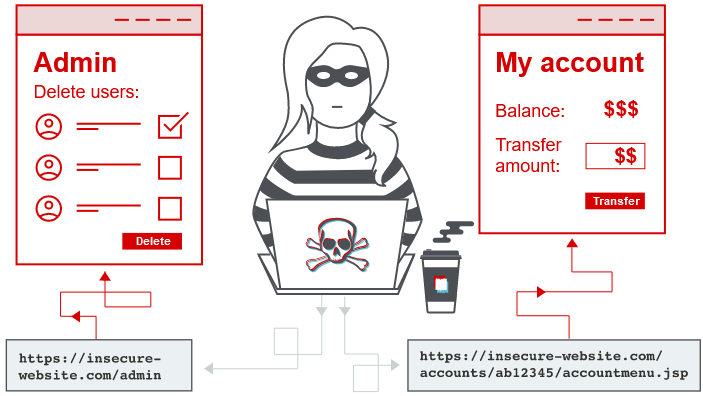
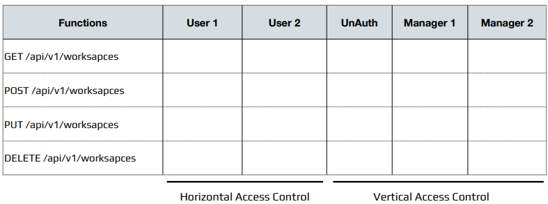

# **1. Định nghĩa**

- ***Access control (hoặc Authorization)*** là việc áp dụng các ràng buộc về ai (hoặc cái gì) có thể thực hiện các hành động đã cố gắng hoặc truy cập tài nguyên mà họ đã yêu cầu. Trong ngữ cảnh của ứng dụng web, kiểm soát truy cập phụ thuộc vào xác thực và quản lý phiên:

  - Xác thực xác định người dùng và xác nhận rằng họ đúng như họ nói.

  - Quản lý phiên xác định những yêu cầu HTTP tiếp theo nào đang được thực hiện bởi cùng một người dùng.

  - Kiểm soát truy cập xác định xem người dùng có được phép thực hiện hành động mà họ đang cố gắng thực hiện hay không.

- Từ góc độ người dùng, kiểm soát truy cập có thể được chia thành các loại sau:

  - ***Quản lý truy cập theo chiều dọc***: giới hạn quyền truy cập vào các chức năng hoặc dữ liệu nhạy cảm theo đặc quyền tối thiểu. Các nhóm đặc quyền (nhóm người dùng) khác nhau thì có quyền truy cập vào các chức năng khác nhau.

  - ***Kiểm soát truy cập theo chiều ngang***: giới hạn quyền truy cập vào tài nguyên đối với những ai được phép hoặc sở hữu cụ thể tài nguyên đó. Tức là chỉ có tôi mới xem và cập nhật dữ liệu của tôi, nếu tôi xem hoặc sửa đổi được dữ liệu của người khác thì đó là lỗi. Ví dụ, một ngân hàng sẽ cho phép người dùng xem lịch sử giao dịch và thanh toán từ
tài khoản của họ chứ không phải từ một người khác.

  - ***Kiểm soát truy cập theo vào ngữ cảnh***: việc hạn chế truy cập vào chức năng và tài nguyên dựa trên trạng thái của ứng dụng. Điều này để ngăn chặn người dùng thực hiện một hành động sai logic. Ví dụ, trang web bán hàng không cho phép người dùng sửa đổi số lượng hàng trong hoá đơn sau khi đã thanh toán.

# [**2. Broken Access Control**](./lab/part1.md)

## 2.1. Leo thang đặc quyền theo chiều dọc: người dùng có quyền truy cập vào chức năng mà học không được phép truy cập

- Chức năng không được bảo vệ (lab 1, 2)

  - URL quản trị có thể được tiết lộ ở  tệp `robots.txt` hay tệp `sitemap.xml`.

  - Tìm kiếm các URL trong js, HTML comment.

- Phương pháp kiểm soát truy cập dựa trên tham số (lab 3, 4)

  - Sau khi đăng nhập, một số ứng dụng sử dụng các Hidden Fields, Cookie hoặc Query Parameter để kiểm soát đặc quyền.

  - Những giá trị này có thể dễ dàng quan sát và sửa đổi trong Burp Suite

- Kiểm soát truy cập bị hỏng do cấu hình sai nền tảng (lab 5, 6)

## 2.2. Leo thang đặc quyền theo chiều ngang: khi một người dùng có quyền truy cập vào các tài nguyên của người khác (ngang hàng với họ)

(lab 7, 8, 9)

## 2.3. Leo thang đặc quyền theo chiều ngang sang chiều dọc (lab 10)

## 2.4. Insecure direct object references (IDOR) (lab 11)

- IDOR phát sinh khi một ứng dụng sử dụng đầu vào do người dùng cung cấp để truy cập trực tiếp vào các đối tượng và kẻ tấn công có thể sửa đổi đầu vào để có được quyền truy cập trái phép.

## 2.5. Lỗ hổng Access control trong quy trình nhiều bước (lab 12)

Nhiều trang web thực hiện các chức năng quan trọng qua một loạt các bước. Điều này thường được thực hiện khi cần nắm bắt nhiều đầu vào hoặc tùy chọn khác nhau hoặc khi người dùng cần xem lại và xác nhận chi tiết trước khi thực hiện hành động. Ví dụ: chức năng quản trị để cập nhật thông tin người dùng có thể bao gồm các bước sau:

  1. Tải biểu mẫu chứa thông tin chi tiết cho một người dùng cụ thể.
  
  2. Gửi thay đổi.
  
  3. Xem lại các thay đổi và xác nhận.

## 2.6. Referer-based access control (lab 13)

# **3. How to test**

- Tạo tài khoản

  - Tạo hai tài khoản ngang hàng

  - Tạo hai tài khoản ở cấp độ khác nhau

- Khám phá tính năng mới

  - Tập trung vào các Function trả về dữ liệu nhạy cảm

  - Tập trung vào các Function mà có thể sửa lại dữ liệu

- Thay đổi các tham số và quan sát

  - Thay đổi ID theo các logic về Access Control

  - Nếu ID mã hoá thì thử giải mã, nếu không giải được thì bỏ qua

  - Nếu ID sửa mà báo lỗi thì tìm cách Bypass

  - Nếu ID không đoán được thì tìm xem ID đó có thể rò rỉ ra thứ gì đó không

- Sử dụng bảng Authentications Matrix Tables

- Đối với các Website có sử dụng Cookie, JWT, API Keys, Tokens để phục vụ cho việc xác thực.

  - Đăng nhập vào website bằng một user bình thường, có mức phân quyền thấp

  - Thay thế cái Token của user cấp thấp để thực hiện các Request của user có quyền cao

  - Kiểm tra và so sánh Response trả về

- Tìm hiểu ID được tạo ra như nào

  - Số tự nhiên hay tuân theo một thuật toán, quy luật nào đó

- Mỗi khi thấy một giá trị ID trong endpoint, ví dụ /api/user/<ID>/news, /api/user/<ID>/transaction, thì hãy đặt các câu hỏi

  - Nếu thay đổi ID này nó có ra thông tin người khác không?

  - ID này có thể xem được ở các mức độ phân quyền khác nhau không?

# **4. Kinh nghiệm test**

- Sử dụng công cụ Intruder để thực hiện việc fuzzing ID, đừng dùng tay

- Nếu ID là số, hãy thử các số từ nhỏ cho tới rất lớn, biết đâu có những ID là số lớn ẩn

- Nếu API có dạng /api/users/info, hãy thử Fuzzing để biết đâu sẽ có những API dạng /api/admins/info

- /api/v3/ có thể fix lỗi nhưng biết đâu /api/v1/ vẫn còn lỗ hổng

- Thử thay đổi HTTP Method GET/PUT/POST/DELETE

- Sử dụng AutoRepeater để tự động cho việc Thay thế giá trị và Gửi Request

- Sử dụng công cụ AuthMatrix để test các chức năng API có sử dụng nhiều quyền (User, Manager, Admin, ...)

# **5. Phòng chống**

- Triển khai Access control và Session Management

- Không sử dụng Direct Object References

- Sử dụng GUIDs hoặc Random để tạo ra ID

- Kiểm tra User Input

- **Mở rộng công cụ tìm kiếm**

  - Dirsearch để tìm kiếm file và thư mục

  - Tìm kiếm thư mục nhạy cảm trong Source `HTML, JavaScript, robots.txt`
