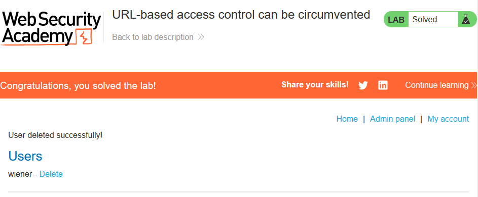

# [Lab 1: Unprotected admin functionality](https://portswigger.net/web-security/access-control/lab-unprotected-admin-functionality)

> - **Mô tả lab:** `admin panel` không được bảo vệ.
>
> - **Mục tiêu:** xóa `carlos`.

Tìm kiếm trong source HTML cũng không phát hiện được gì, `dirsearch` xem có đường dẫn nhạy cảm không

Phát hiện thấy có file `robots.txt` có thể đọc được, trong này chứa đường dẫn không được phép

Tuy nhiên truy cập thì không thấy bị cấm gì hết dù mình không phải `admin`

xóa `carlos` và solve lab

# [Lab 2: Unprotected admin functionality with unpredictable URL](https://portswigger.net/web-security/access-control/lab-unprotected-admin-functionality-with-unpredictable-url)

tìm kiếm trong HTML thì phát hiện luôn một đoạn script check `admin` và có đường dẫn đến `admin panel`

truy cập `/admin-eiev4j` thì cũng vẫn được dù không phải là `admin`

delete `carlos` and solve the lab

# [Lab 3: User role controlled by request parameter](https://portswigger.net/web-security/access-control/lab-user-role-controlled-by-request-parameter)

> - **Mô tả lab:** bảng quán trị tại `/admin`, bảng này xác định các quản trị viên sử dụng cookie có thể giả mạo.
>
> - **Mục tiêu:** truy cập `/admin` và xóa `carlos`.

Đăng nhập `wiener:peter`và truy cập `/admin`, thì ta không thể truy cập được như 2 lab trước mà phải đăng nhập là một `administrator`

Quan sát request ta thấy tại cookie có tham số check `Admin=false`

Ta đổi thành `true` thì truy cập thành công rồi

xóa `carlos` và solve lab

# [Lab 4: User role can be modified in user profile](https://portswigger.net/web-security/access-control/lab-user-role-can-be-modified-in-user-profile)

> - **Mô tả lab:** bảng quán trị tại `/admin`, bảng này chỉ truy cập được với người dùng có `roleid=2`.
>
> - **Mục tiêu:** truy cập `/admin` và xóa `carlos`.

Sau khi đăng nhập `wiener:peter`, hiển nhiên khi truy cập `/admin` thì bị block. Giờ ta sẽ tìm cách truy cập.

Khi sử dụng `Update email` để cập nhật email thì phát hiện trong response lại trả về thông tin người dùng, trong đó có `roleid`

Thay đổi roleid thành 2 để có thể truy cập `admin panel`

Đến `/admin` thì đã vượt quyền thành công rồi

xóa `carlos` và solve lab

# [Lab 5: URL-based access control can be circumvented](https://portswigger.net/web-security/access-control/lab-url-based-access-control-can-be-circumvented)

> - **Mô tả lab:** bảng quán trị tại `/admin`, nhưng đã chặn quyền truy cập từ bên ngoài vào đường dẫn này. Tuy nhiên có hỗ trợ tiêu đề `X-Original-URL`.
>
> - **Mục tiêu:** truy cập `/admin` và xóa `carlos`.

Truy cập trang web, ta thấy có `Admin panel`, tuy nhiên truy cập thì bị cấm `403`

Vậy ta sẽ truy cập gián tiếp `/admin` qua header `X-Original-URL`

Truy cập đường dẫn xóa để xóa `carlos`, thì bị `missing parameter`

Ta sẽ đưa tham số lên ơath

solve lab

# [Lab 6: Method-based access control can be circumvented](https://portswigger.net/web-security/access-control/lab-method-based-access-control-can-be-circumvented)

> - **Mô tả lab:** Triển khai kiểm soát truy cập một phần dựa trên HTTP method. Làm quen với bảng quản trị bằng tài khoản `administrator:admin`
>
> - **Mục tiêu:** đăng nhập `wiener:peter`, khai thác lỗi để tự nâng cấp thành quản trị viên.

Đăng nhập với `administrator:admin` rồi vào `Admin panel` thấy có chức năng update role cho các tài khoản

Thử update, ta nhận được 1 Request với method là `POST`

Logout và đăng nhập với `wiener:peter` và tự thăng cấp

Lấy Request thay đổi quyền ở trên và lưu ý cần phải thay đổi session thành session của `wiener`, tuy nhiên thử POST thì không update được

vậy thử đổi sang method GET thì lại ok

solve lab

# [Lab 7: User ID controlled by request parameter](https://portswigger.net/web-security/access-control/lab-user-id-controlled-by-request-parameter)

> - **Mô tả lab:** Lỗ hổng leo thang đặc quyền theo chiều ngang trên trang tài khoản của người dùng.
> 
> - **Mục tiêu:** lấy khóa API của `carlos` và nộp.

Trang tài khoản người dùng có khóa API

Quan sát URL ta thấy rằng có tham số `id=wiener`

ta sẽ đổi thành `carlos` và ta có thể đọc thông tin của `carlos` thành công

lấy được API Key, submit and solve the lab

# [Lab 8: User ID controlled by request parameter, with unpredictable user IDs ](https://portswigger.net/web-security/access-control/lab-user-id-controlled-by-request-parameter-with-unpredictable-user-ids)

> - **Mô tả lab:** Lỗ hổng leo thang đặc quyền theo chiều ngang trên trang tài khoản của người dùng nhưng xác định người dùng bằng `GUID`.
> 
> - **Mục tiêu:** lấy khóa API của `carlos` và nộp.

Đăng nhập `wiener:peter`, Trang tài khoản người dùng có thông tin khóa API, ta sẽ từ `wiener` có thể đọc thông tin tài khoản của `carlos`

Tuy nhiên ta thấy `id` đã thay đổi không còn là `username` mà là một chuỗi khó đoán hơn

Vậy ta cần tìm `id` của `carlos`, chú ý rằng trang web của ta có rất nhiều các bài viết

`View post` của tác giả `wiener` ta thấy có tham số `userID` và ta phát hiện giá trị này giống với `id` ở trang tài khoản

Vậy ta cần tìm bài viết của `carlos` để lấy `userId`

Đến trang tài khoản, thay id thàng userId ta vừa lấy được và thành công lấy khóa API

submit và solve

# [Lab 9: User ID controlled by request parameter with data leakage in redirect](https://portswigger.net/web-security/access-control/lab-user-id-controlled-by-request-parameter-with-data-leakage-in-redirect)

> - **Mô tả lab:** Lỗ hổng kiểm soát truy cập khiến thông tin bị rò rỉ trong nội dung redirect.
> 
> - **Mục tiêu:** lấy khóa API của `carlos` và nộp.
main web

Ở lab này, thì trang tài khoản đã được truy cập với `id=username`, ta sẽ đổi thành `carlos` xem có thể thấy được thông tin không

Tuy nhiên thì trang web sẽ ngay lập tức redirect sang trang `login`, nhưng xem Request truyền đi thì thấy trước khi redirect thì trang thông tin tài khoản của `carlos` đã được hiển thị rồi

submit và solve lab

# [Lab 10: User ID controlled by request parameter with password disclosure](https://portswigger.net/web-security/access-control/lab-user-id-controlled-by-request-parameter-with-password-disclosure)

> - **Mô tả lab:** Trang tài khoản người dùng chứa mật khẩu của người dùng hiện tại, được điền trước bằng thông tin nhập ẩn.
> 
> - **Mục tiêu:** lấy mật khẩu của `administrator`, xóa `carlos`.

Trang tài khoản người dùng làm lộ thông tin password của người dùng đó

Lấy mật khấu của `administrator` thôi

login thành công, truy cập `Admin panel`

xóa `carlos` và solve

# [Lab 11: Insecure direct object references](https://portswigger.net/web-security/access-control/lab-insecure-direct-object-references)

> - **Mô tả lab:** Lab này lưu trữ nhật ký trò chuyện của người dùng trực tiếp trên hệ thống tệp của máy chủ và truy xuất chúng bằng URL tĩnh.
> 
> - **Mục tiêu:** lấy mật khẩu của `carlos` và đăng nhập.

Test chức năng Live chat, thấy có `View transcript`, nó sẽ download cho ta 1 file và file này được tự động đặt tên `2.txt`. Vậy file `1.txt` thì ???

Xem thử, thì lộ password rồi

Đăng nhập và solve lab

# [Lab 12: Multi-step process with no access control on one step](https://portswigger.net/web-security/access-control/lab-multi-step-process-with-no-access-control-on-one-step)

> - **Mô tả lab:** Bảng quản trị với quy trình gồm nhiều bước chưa hoàn thiện để thay đổi vai trò của người dùng.
> 
> - **Mục tiêu:** đăng nhập `wiener:peter`, tiến hành tự thăng cấp thành quản trị viên.

Đăng nhập `administrator:admin`, truy cập `Admin panel` để thực hiện thăng cấp quản trị cho các tài khoản

Khi thực hiện upgrade, sẽ thêm 1 bước confirm nữa

Đăng nhập `wiener:peter` và tiến hành tự nâng cấp quyền quản trị, khi ta yêu cầu thăng cấp thì không được vì không có quyền

Tuy nhiên ta thấy 2 Request upgrade và confirm, và dường như request confirm chỉ thêm tham số `confirmed` mà thôi, vẫn có các tham số của Request upgrade

Vậy ta sẽ dùng Request confirm để bypass luôn

Vậy là solve lab rồi

# [Lab 13: Referer-based access control](https://portswigger.net/web-security/access-control/lab-referer-based-access-control)

> - **Mô tả lab:** Kiểm soát quyền truy cập vào chức năng quản trị nhất định dựa trên header `Referer`.
> 
> - **Mục tiêu:** đăng nhập `wiener:peter`, tiến hành tự thăng cấp thành quản trị viên.

Thay đổi dễ dàng là solve rồi

Solve lab

