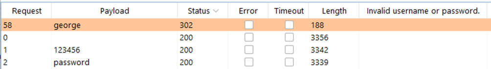
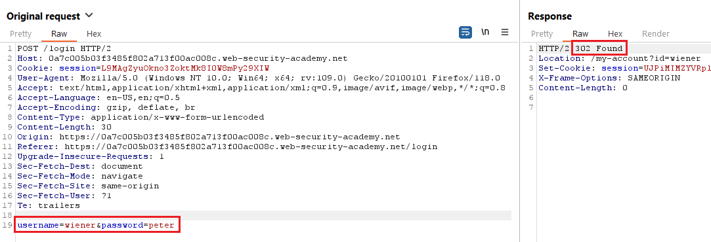
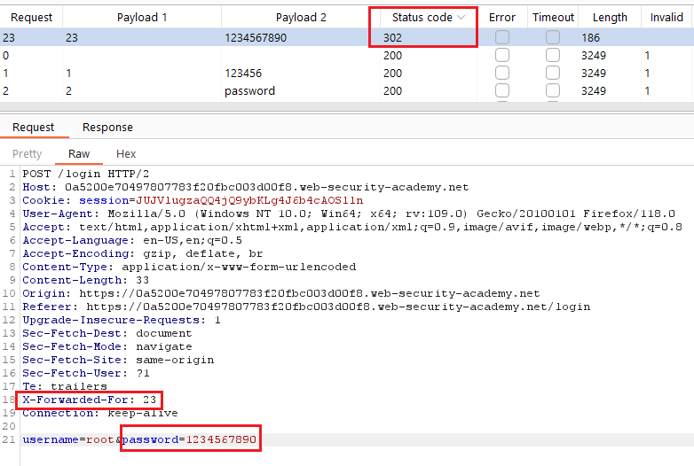
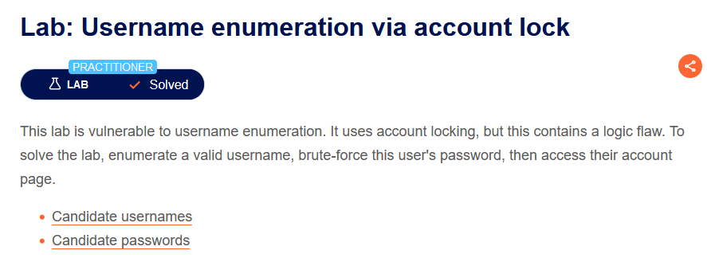

# [Lab 1: Username enumeration via different responses](https://portswigger.net/web-security/authentication/password-based/lab-username-enumeration-via-different-responses)

> - **Mô tả lab:** có thể liệt kê username và brute-force password.
>
> - **Mục tiêu:** tìm username tồn tại, brute-force password và login vào tài khoản đó.

Đây là trang web chính của bài lab, ta có thể dễ dàng thấy các chức năng:

- `Home:` trở về blog

- `My account:` thông tin tài khoản

- `View post:` xem thông tin bài viết

Đến `My account`, khi ta chưa đăng nhập, sẽ chuyển đến trang Login, đây là nơi chúng ta cần brute-force

Thử đăng nhập với username và password bất kỳ ta nhận được Message `Invalid username` → tài khoản có username ‘a’ chưa tồn tại → lợi dụng nó để tìm kiếm username tồn tại

Với tài khoản có username ‘agenda’ không thấy có message → đây là tài khoản đã tồn tại

→ Thử đăng nhập với username ‘agenda’ ta thấy Message `Incorrect password` → lợi dụng để bypass

làm tương tự như username, ta cũng tìm được password

> Note: Ngoài ra ta có thể brute-force cả 2 vị trí cùng lúc, tuy nhiên payload nhiều hơn nên sẽ mất thời gian hơn rất nhiều

Tìm được rồi

login and solve

# [Lab 2: Username enumeration via subtly different responses](https://portswigger.net/web-security/authentication/password-based/lab-username-enumeration-via-subtly-different-responses)

> - **Mô tả lab:** nói chung là giống **lab 1**

Bài này tương tự như Lab 1 nhưng sự khác biệt là khi đăng nhập thì message khác chỉ chung chung là `Invalid username or password` chứ không message riêng như lab 1, tuy nhiên khi tồn tại thì message này cũng không xuất hiện nên làm như lab 1 vẫn thành công.

tìm được username

tìm được password

login and solve the lab

# [Lab 3: Username enumeration via response timing](https://portswigger.net/web-security/authentication/password-based/lab-username-enumeration-via-response-timing)

> - **Mô tả lab:** có thể liệt kê username dựa trên thời gian phản hồi.
>
> - **Mục tiêu:** tìm username tồn tại, brute-force password và login vào tài khoản đó.

main web

đăng nhập sai thì message vẫn tương tự như các bài lab trên

tuy nhiên khi ta cố gắng đăng nhập sai nhiều lần → sẽ bị block một khoảng thời gian

Sau đó dù có đăng nhập với tài khoán chính xác thì cũng không thể đăng nhập thành công, rất có thể là do chặn IP rồi.

Tuy nhiên, web có hỗ trợ header `X-Forwarded-For`, cho phép ta giả mạo địa chỉ IP và bypass bảo vệ brute-force dựa trên IP. Khi thêm header vào thì ta đã hết bị block rồi. Vậy ta sẽ dùng nó để bypass bài này.

chú ý status code khi đăng nhập thành công: `302`

Set up tấn công, tìm username trước

tìm password

login and solve

 
# [Lab 4: Broken brute-force protection, IP block](https://portswigger.net/web-security/authentication/password-based/lab-broken-bruteforce-protection-ip-block)

> - **Mô tả lab:** lỗ hổng trong cơ chế bảo vệ brute-force password.
>
> - **Mục tiêu:** tìm password của `carlos` và login.

Các message báo lỗi

Sau khi đăng nhập sai quá 3 lần, IP sẽ bị block trong 1 khoảng thời gian.

Tuy nhiên thời gian này ngắn quá, sau khoảng thời gian này ta có thể đăng nhập lại bình thường. Nếu đợi để brute-force thì khá lâu, ta thử 1 lần đăng nhập thất bại và sau đó sẽ là 1 lần đăng nhập đúng thì vẫn đăng nhập được bình thường nên ta sẽ sử dụng cách này để tìm password của `carlos`

Khi đăng nhập chính xác, chú ý status code `302`

Set up tấn công

- tạo trước 1 list username password: xen kẽ các payload 

- set up Intruder

- tìm thấy password

Login and solve

# [Lab 5: Username enumeration via account lock](https://portswigger.net/web-security/authentication/password-based/lab-username-enumeration-via-account-lock)

> - **Mô tả lab:** lỗi liệt kê username, sử dụng khóa tài khoản tuy nhiên có lỗi logic.
>
> - **Mục tiêu:** liệt username tồn tại, brute-force password và login vào tài khoản đó.

Thử đăng nhập với tài khoản bất kỳ nhưng không thấy có message nào ngoài `Invalid username or password` bởi các tài khoản này đều không hề tồn tại. Giờ ta cần phải đi tìm các tài khoản tồn tại để solve lab.

Thử brute-force cả 2 position `username` và `password` luôn và Extract dữ liệu theo thông báo warning

thì phát hiện có 1 tài khoản không hề có warning gì

Đăng nhập thành công → solve lab

Tuy nhiên test như trên thì hơn khoảng 10000 Request nên rất lâu. Ta nên tìm `username` trước.

Ta tìm được 1 tài khoản có message khác với các tài khoản còn lại `You have made too many incorrect login attempts. Please try again in 1 minute(s).` Chắc hẳn đây là tài khoản tồn tại cần tìm rồi.

Sau đó tương tự như trên nhưng chỉ cần brute-force cho password là ra.

# [Lab 6: Broken brute-force protection, multiple credentials per request](https://portswigger.net/web-security/authentication/password-based/lab-broken-brute-force-protection-multiple-credentials-per-request)

> - **Mô tả lab:** lỗ hổng trong cơ chế bảo vệ brute-force.
>
> - **Mục tiêu:** tìm password của `carlos` và login.

vẫn là những message quen thuộc

và vẫn bị block khi nhập sai quá nhiều

Quan sát Request thì thấy bài này body là một đoạn `Javascript` chứ không phải `key=value` như các bài trước

thử thay bằng mảng các password coi có bị kiểm tra gì không và kết quả cho thấy là nó vẫn duyệt bình thường

Thử với `carlos` coi có login thành công không

Thành công rồi solve lab thôi

