## [Lab 7: 2FA simple bypass](https://portswigger.net/web-security/authentication/multi-factor/lab-2fa-simple-bypass)

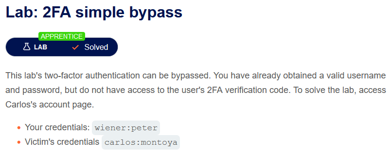

> - **Mô tả lab:** xác thực 2 yếu tố có thể được bỏ qua.
>
> - **Mục tiêu:** truy cập vào trang tài khoản của `carlos`

login with `wiener:peter`

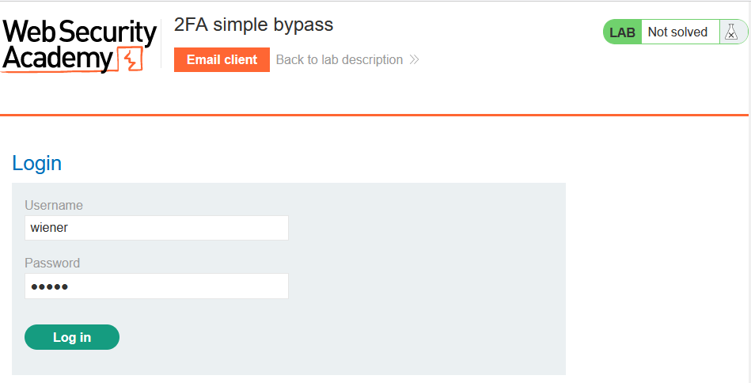

Yêu cầu mã xác thực

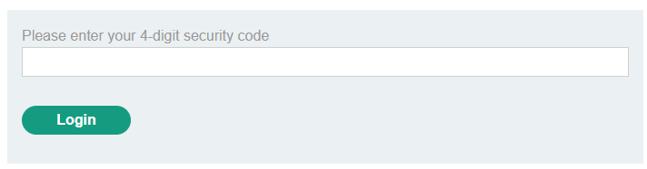

Mã code sẽ được gửi qua mail của người dùng

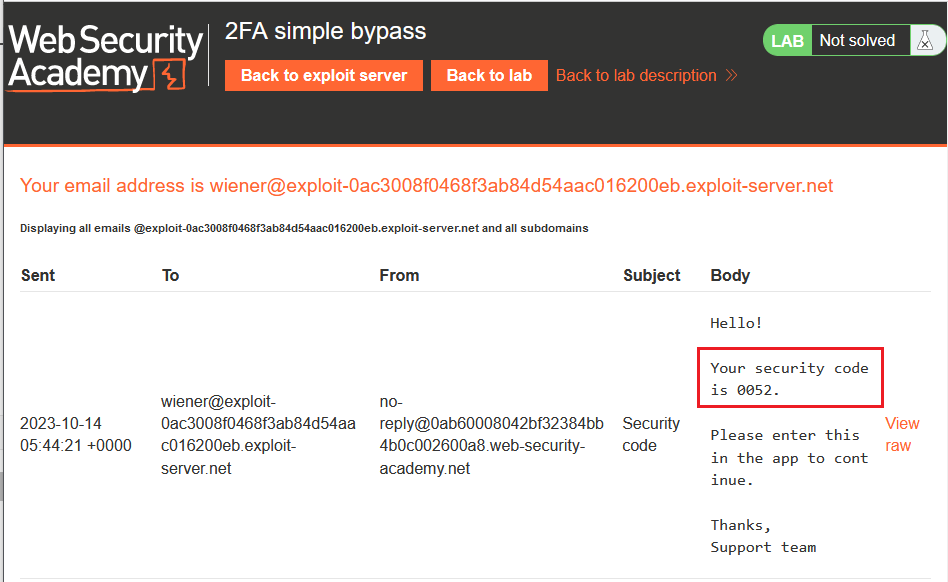

nhập mã và login

sau khi login sẽ redirect ta đến `/my-account?id=wiener`

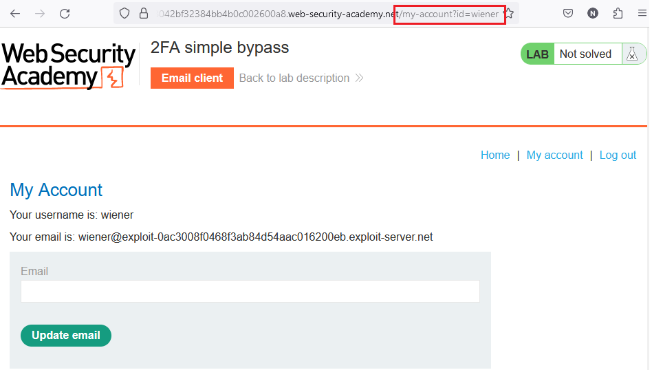

Đăng nhập với `carlos:montoya` và hiển nhiên là sẽ yêu cầu nhập mã xác thực, và do không có email nên mã này ta không thể lấy được. Tuy nhiên thì xác thực 2 yếu tố bài này có thể bị bỏ qua.

Cứ thế không nhập mã mà quay lại trang account trước đó thay `wiener` thành `carlos` và solve lab luôn

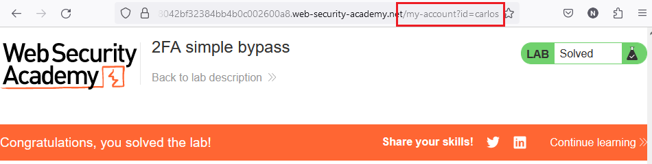

## [Lab 8: 2FA broken logic](https://portswigger.net/web-security/authentication/multi-factor/lab-2fa-broken-logic)

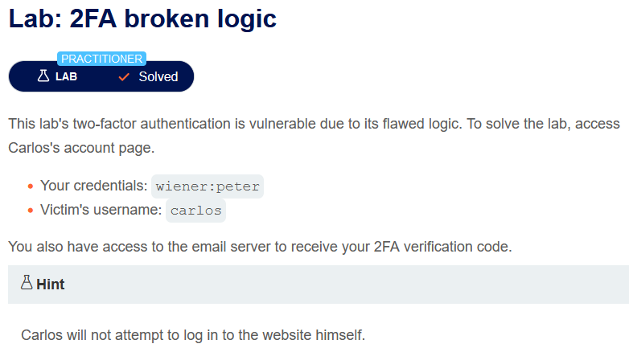

> - **Mô tả lab:** xác thực 2 yếu tố có lỗi logic
>
> - **Mục tiêu:** truy cập trang tài khoản của `carlos`

login với `wiener:peter` thì ta thấy vẫn như lab trên, tuy nhiên ta không có password của `carlos` để đăng nhập và bypass như bài trên được.

Tuy nhiên ta chú ý trong Request có tham số `verify` xác định tài khoản của người dùng nào đang được truy cập

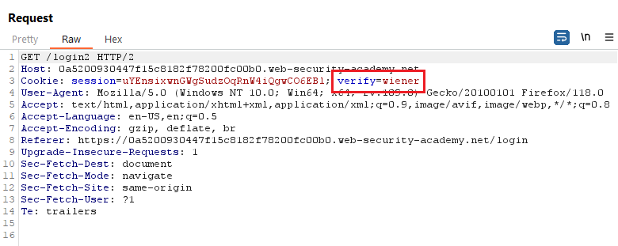

Ý tưởng lúc này, ta sẽ thử thay thành `carlos` để có mã xác thực, tuy nhiên ta không thể lấy được mã xác thực này do không có email người dùng, nên chỉ có thể brute-force thôi

chú ý mã của chúng ta sẽ có 4 chữ số

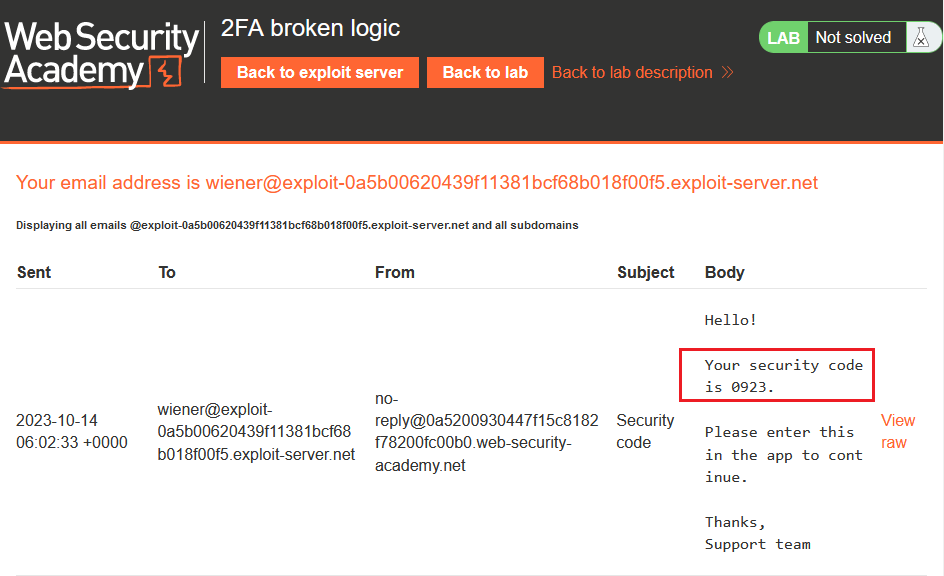

sau khi logout `wiener:peter`, ta bắt đầu thực hiện send Request để có mã

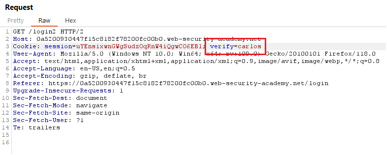

Sau đó là brute-force mã

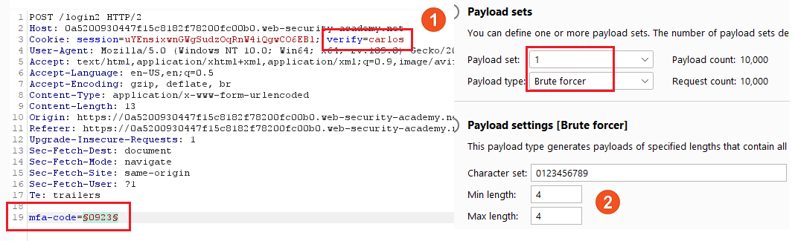

Tìm được mã rồi, `Show response in browser` để thấy kết quả

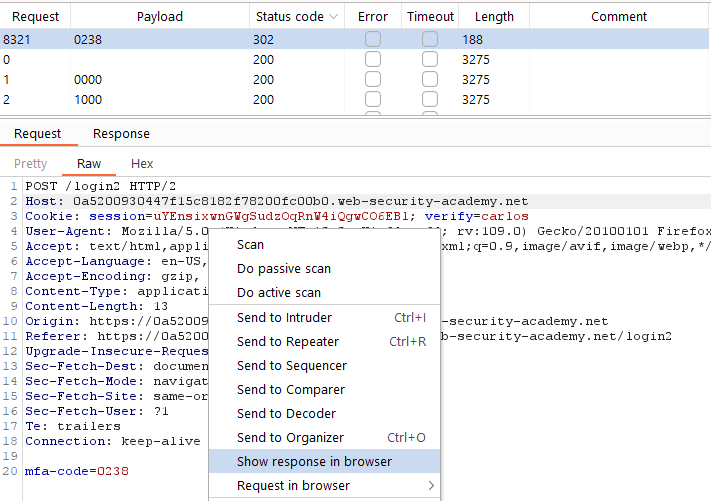

sovle lab

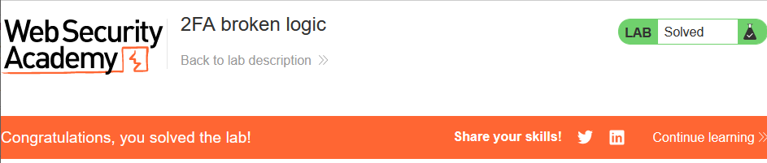
