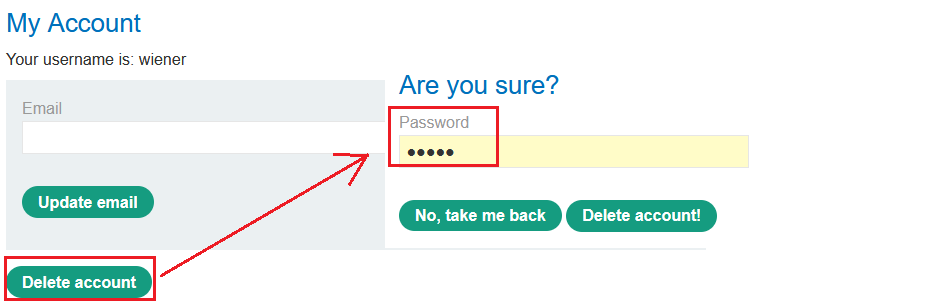
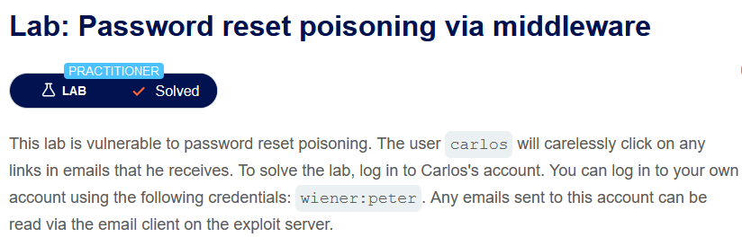

## [Lab 10: Brute-forcing a stay-logged-in cookie](https://portswigger.net/web-security/authentication/other-mechanisms/lab-brute-forcing-a-stay-logged-in-cookie)

> - **Mô tả lab:** cho phép người dùng duy trì trạng thái đăng nhập ngay cả sau khi họ đóng phiên trình duyệt. Cookie được sử dụng để cung cấp chức năng này dễ bị tấn công brute-force.
>
> - **Mục tiêu:** brute-force cookie của `carlos` để truy cập vào trang tài khoản.

login `wiener:peter`, chú ý có lựa chọn `stay logged in`

sau khi login thành công sẽ redirect sang `/my-account?id=wiener`, ta chú ý Request lúc này có thêm tham số  `stay-logged-in`

Kiếm tra tham số này trong tab `Inspector` thì phát hiện bị base64-encoded

Chuỗi đằng sau có vẻ là password rồi, và rất có thể nó là một mã hash, sử dụng [CrackStation](https://crackstation.net/) đề giải mã thì thấy đúng là password của `wiener` rồi, và hàm băm được sử dụng là `MD5`

Lộ mật khẩu vậy thì ta sẽ dùng nó để brute-force cho tham số này và tìm kiếm password cho `carlos`. cookie có dạng: `base64-encoded(username:md5_hash_password)`

1. **hashed password:** sử dụng hàm băm MD5

2. **thêm prefix:** `username:`

3. **base64-encoded**

> NOTE: trước khi brute-force cứ logout cho chắc nhé.

Tìm được password phù hợp rồi

login and solve lab

## [Lab 11: Offline password cracking](https://portswigger.net/web-security/authentication/other-mechanisms/lab-offline-password-cracking)

> - **Mô tả lab:** Lưu trữ password hash của người dùng trong cookie. Ngoài ra còn có lỗi XSS trong chức năng XSS
>
> - **Mục tiêu:** lấy cookie `stay-logged-in` của `carlos` và dùng nó để lấy password sau đó đăng nhập xóa tài khoản

Vẫn như **lab 10** nhưng khó hơn do không thể brute-force được vì không đoán được list password

Muốn `delete` account thì cũng yêu cầu password nên bắt buộc phải tìm thôi

`Stay-logged-in` vẫn như **lab 10** và có dạng `base64-encoded(username:md5_hash_password)`, và đặc biệt là nó ở cookie, ta xem có cách nào để trộm cookie không.

Khi test các chức năng còn lại của web, ta phát hiện website đã bị lỗi XSS ở `Comment`, chèn script vào comment

`Back to blog` ta sẽ thấy hộp thoại cảnh báo xuất hiện

Do vậy nên ta có thể sử dụng `document.cookie` để lấy cookie rồi. Tuy nhiên để xem được nó,  ta sẽ gửi kết quả nhận được về `exploit server` của chúng ta.

Đợi khi `carlos` truy cập, thì sẽ có log gửi về

get it and decode

tìm được password rồi, đến xóa account và solve lab

## [Lab 12: Password reset broken logic](https://portswigger.net/web-security/authentication/other-mechanisms/lab-password-reset-broken-logic)

> - **Mô tả lab:** lỗi ở chức năng reset password.
>
> - **Mục tiêu:** reset password của `carlos` và đăng nhập.

Chức năng `Forgot password` có thể giúp ta reset password

Khi reset cần nhập username hoặc email

và liên kết reset password sẽ được gửi về mail của người dùng

Khi reset thì ta nhận thấy nó không hề  yêu cầu nhập password cũ, như vậy rất dễ để thay đổi password mà không cần biết password cũ là gì

Request thay đổi password

Ta thấy có tham số `temp-forgot-password-token`, ta cứ dùng cái của `wiener` xem có bypass được không, sau đó thay đổi `wiener` thành `carlos`

sau đó thử login với password mới thì thành công và solve lab luôn

## [Lab 13: Password reset poisoning via middleware](https://portswigger.net/web-security/authentication/other-mechanisms/lab-password-reset-poisoning-via-middleware)

> - **Mô tả lab:** Lỗi có thể đầu độc reset password. `carlos` có thể bất cẩn nhấn vào các liên kết trong email nhận được. Mọi email nhận được đều được đọc qua Email client trên exploit server.
>
> - **Mục tiêu:** login `carlos`.

vẫn như **lab 12** ta thấy Request thay đổi mật khẩu không có `username` vậy nên chắc chẳn là bị check cả tham số `temp-forgot-password-token` rồi nên không thể bypass như **lab 12** được

Do các email nhận được đều được đọc qua Exploit server nên ta sẽ dùng 1 header là `X-Forward-Host` để chuyển request đến server của chúng ta và quan sát trong access log, xem có token nào được gửi đến không

trước tiên send Request Forgot password đã, và đương nhiên send đến Host của chúng ta rồi sử dụng header 

Quan sát access log ta thấy kết quả đã được trả về

đổi token rồi change password thôi

login and solve the lab

## [Lab 14: Password brute-force via password change](https://portswigger.net/web-security/authentication/other-mechanisms/lab-password-brute-force-via-password-change)

> - **Mô tả lab:** Lỗi ở thay đổi password có thể bị tấn công brute-force. Email gửi đến tài khoản đều có thể đọc thông qua exploit server.
>
> - **Mục tiêu:** login `carlos` account

`Change password` đã phải nhập thêm mật khẩu hiện tại, hmmmm khó đây

Khi ta nhập 2 new passowrd khác nhau sẽ có thông báo `New passwords do not match`

Khi nhập password hiện tại sai thì lại có message `Current password is incorrect`

Giờ thì brute-force password cho `carlos`

thấy rồi

login and solve the lab

