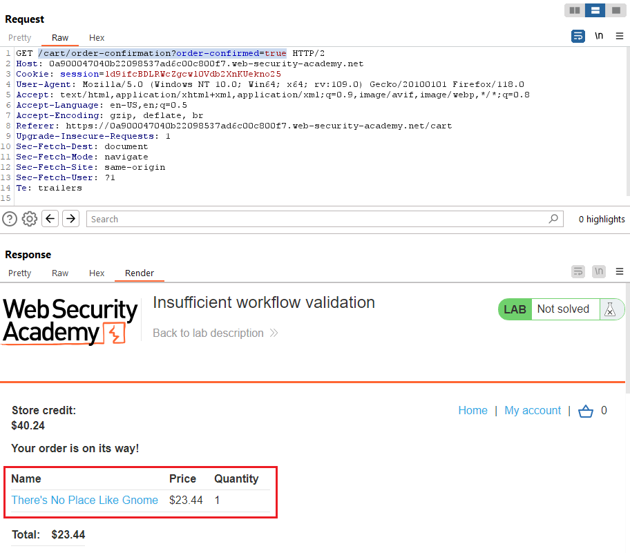
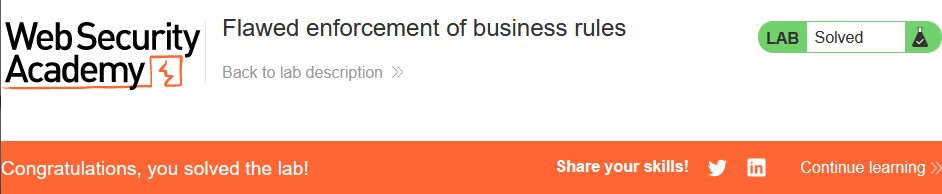

# [Lab 1: Excessive trust in client-side controls](https://portswigger.net/web-security/logic-flaws/examples/lab-logic-flaws-excessive-trust-in-client-side-controls)

> - **Mô tả lab:** Không xác nhận đầy đủ thông tin đầu vào của người dùng. Khai thác lỗ hổng logic trong quá trình mua hàng để mua các mặt hàng với mức giá ngoài ý muốn.
>
> - **Mục tiêu:** Khai thác lỗ hổng, mua `Lightweight l33t leather jacket`.

Trang web chính, ta dễ dàng thấy mặt hàng cần mua ở ngay đầu tiên

Đăng nhập `wiener:peter`, coi có bao nhiêu money nào

Có $100 thôi không đủ mua :( Vậy mình thử tấn công bằng cách sửa giá tiền xem

Dùng Proxy để chặn Request add sản phẩm vào giỏ hảng thì ta thấy có tham số `price` ở đây

Cập nhật `price` trong khoảng có thể mua được xem có thành công không

OK, thêm thành công vào giỏ hảng

Vậy thì `Place order` và solve lab thôi

# [Lab 2: High-level logic vulnerability](https://portswigger.net/web-security/logic-flaws/examples/lab-logic-flaws-high-level)

> - **Mô tả lab:** Không xác nhận đầy đủ thông tin đầu vào của người dùng. Khai thác lỗ hổng logic trong quá trình mua hàng để mua các mặt hàng với mức giá ngoài ý muốn.
>
> - **Mục tiêu:** Khai thác lỗ hổng, mua `Lightweight l33t leather jacket`.

Trang web chính, ta dễ dàng thấy mặt hàng cần mua ở ngay đầu tiên

Vẫn tương tự như **lab 1**, và không đủ tiền để mua mặt hàng đó, tuy nhiên khác ở chỗ là trong Request gửi đi không có tham số `price`

Vậy thử các tham số khác xem, thử `quantity` trước, add 1 sản phẩm khác ta thử là 1 số âm coi sao

Thêm thành công, số lượng lúc này đã là một số âm

Vậy ta sẽ thêm các mặt hàng cho đến khi tổng số tiền trong khoảng có thể mua

OK, total price đủ để mua rồi, `place order` và solve lab thôi

# [Lab 3: Low-level logic flaw](https://portswigger.net/web-security/logic-flaws/examples/lab-logic-flaws-low-level)

> - **Mô tả lab:** Không xác nhận đầy đủ thông tin đầu vào của người dùng. Khai thác lỗ hổng logic trong quá trình mua hàng để mua các mặt hàng với mức giá ngoài ý muốn.
>
> - **Mục tiêu:** Khai thác lỗ hổng, mua `Lightweight l33t leather jacket`.

Trang web chính, ta dễ dàng thấy mặt hàng cần mua ở ngay đầu tiên

vẫn tương tự như **lab 2**, tuy nhiên không add số lượng âm được, số lượng `< 0` thì sẽ bị xóa khỏi giỏ hảng luôn, hmmm tìm cách tiếp, ta xem giới hạn có thể add là bao nhiêu

- add đến `100` coi sao

- vậy là ta chỉ có thể add số mặt hàng đến `99` thôi

thử Race Condittion

Một lúc sau F5 thì thấy đến 1 giá trí nhất định, `Total price` sẽ là số âm  rất lớn và nó dần tăng lên về 0

Do không thể mua nếu `Total price` âm nên cần add thêm mặt hàng sao cho đủ điều kiện mua (do số lớn nên cần nhiều Request do đó có thể tiếp tục sử dụng Intruder như trên cho nhanh hơn), `Place order` và solve lab

# [Lab 4: Inconsistent handling of exceptional input](https://portswigger.net/web-security/logic-flaws/examples/lab-logic-flaws-inconsistent-handling-of-exceptional-input)

> - **Mô tả lab:** Không xác nhận đầy đủ thông tin đầu vào của người dùng. Khai thác lỗ hổng logic trong quá trình đăng ký tài khoản để có quyền truy cập vào chức năng quản trị.
>
> - **Mục tiêu:** Khai thác lỗ hổng, truy cập bảng quản trị và xóa `carlos`.

Trước hết, ta tìm URL truy cập đến bảng quán trị đã, ta sẽ sử dụng `dirsearch` để thực hiện điều này

Ta phát hiện `/admin` bị cấm truy cập, ta vào thử coi sao, và thông báo chỉ ra rằng, nó chỉ tồn tại nếu đăng nhập là người dùng `DontWannaCry`

Trang web chính, và ta đã thấy có chức năng `Register`

Đi đến xem để khai thác, ta thấy thông báo đầu tiên, nếu là `DontWannaCry` user sẽ sử dụng địa chỉ email là `@dontwannacry.com`, vậy là sẽ giải quyết được vấn đề trên, giờ thì tìm cách đăng ký thôi. Thông thường, thì tham số email đều sẽ giới hạn ký tự, ta test xem nó giới hạn đến bao nhiêu ký tự. Ta sẽ dùng email ở `Email client` để test vì cần phải confirm và payload email ta sử dụng có 306 ký tự

Vẫn gửi email xác nhận về mail

sau khi xác nhận email, ta đăng nhập thì phát hiện email đã bị cắt bớt rồi

Đếm ký tự thì phát hiện bị giới hạn đến 255 ký tự thôi. Và qua đây ta cũng nhận thấy, nó không có check khi đăng ký, rõ ràng mail lớn hơn 255 ký tự nhưng nó vẫn nhận và gửi link xác nhận về `Email client`.

Giờ ta sẽ đăng ký với `DontWannaCry` user, trước hết phải xác nhận khi có `@dontwannacry.com` nó có đủ 255 ký tự , sau đó sẽ thêm `.exploit-0a8300b20415eb048640c0820162005f.exploit-server.net` để có link confirm.

Sau khi confirm xong thì login ta sẽ thấy bảng quản trị

truy cập xóa account `carlos` và solve

# [Lab 5: Inconsistent security controls](https://portswigger.net/web-security/logic-flaws/examples/lab-logic-flaws-inconsistent-security-controls)

> - **Mô tả lab:** Lỗi logic cho phép người dùng tùy ý truy cập chức năng quản trị mà lẽ ra chỉ dành cho nhân viên công ty.
>
> - **Mục tiêu:** Khai thác lỗ hổng, truy cập bảng quản trị và xóa `carlos`.

Vấn tương tự như **lab 4**, ta cũng cần đăng nhập với user `DontWannaCry` để truy cập bảng quản trị, tuy nhiên khác ở chỗ, lab này ta có thêm chức năng thay đổi email, ta sẽ thay đổi email về `@dontwannacry.com` coi có được không

được luôn và thấy có `Admin panel` rồi

solve lab thôi

# [Lab 6: Weak isolation on dual-use endpoint](https://portswigger.net/web-security/logic-flaws/examples/lab-logic-flaws-weak-isolation-on-dual-use-endpoint)

> - **Mô tả lab:** Đưa ra giả định sai sót về cấp đặc quyền của người dùng dựa trên thông tin đầu vào của họ. Do đó, bạn có thể khai thác tính logic của các tính năng quản lý tài khoản của nó để có quyền truy cập vào tài khoản của người dùng tùy ý.
>
> - **Mục tiêu:** Khai thác lỗ hổng, đăng nhập tài khoản `administrator` và xóa `carlos`.

Đăng nhập `wiener:peter`, ta thấy có chức năng thay đổi password, vậy ý tưởng lúc này là qua đây để thay đổi password của `administrator`. Nhưng mà có `current password` nhưng ta không có password mà thử xem bỏ nó đi thì có thay dổi password được không.

Ta thấy request có các tham số như `username` để xác nhận người dùng và `currentpassword`, dễ dàng tấn công lắm đây :v trước hết bỏ current password xem có thay đổi được không

vẫn thành công nha, giờ ta thay đổi của `administrator`

Đăng nhập thành công rồi nha

Solve lab thôi

# [Lab 7: Insufficient workflow validation](https://portswigger.net/web-security/logic-flaws/examples/lab-logic-flaws-insufficient-workflow-validation)

> - **Mô tả lab:** Đưa ra các giả định thiếu sót về chuỗi sự kiện trong quy trình mua hàng.
>
> - **Mục tiêu:** Khai thác để vượt qua xác thực, truy cập vào giao diện quản trị và xóa người dùng `carlos`.

Ta sẽ quan sát các sự kiện khi thực hiện mua hàng, khi thực hiện mua thì web sẽ redirect đến trang conrfirm để xác nhận order

Ta sẽ lợi dụng Request này để order các sản phẩm trong giỏ hàng mà không cần nhấn `Place order`, test thử với 1 sản phẩm bất kỳ, thêm nó vào giỏ hàng

Send Request confirm đi thì mua hàng thành công luôn

giờ solve lab thôi

# [Lab 8: Authentication bypass via flawed state machine](https://portswigger.net/web-security/logic-flaws/examples/lab-logic-flaws-authentication-bypass-via-flawed-state-machine)

> - **Mô tả lab:** Đưa ra các giả định thiếu sót về chuỗi sự kiện trong quá trình đăng nhập.
>
> - **Mục tiêu:** Khai thác vượt qua xác thực, truy cập giao diện quản trị và xóa `carlos`.

Ta sẽ quan sát các sự kiện khi thực hiện đăng nhập, khi thực hiện đăng nhập thì web sẽ redirect chúng ta đến `/role-selector` để chọn role tiếp tục duyệt web

Ta chỉ thấy có 2 role thôi, không thấy có role cho `administrator` nhỉ

Vậy thì ta thử không chọn role xem sao, bằng cách là ta sẽ sử dụng `Proxy` bặt `Intercept` để chặn Request redirect đến `role-selector` và `Drop` nó đi

Sau đó quay lại web, thì phát hiện đã có bảng quản trị `Admin panel`

Truy cập, xóa `carlos` và solve

# [Lab 9: Flawed enforcement of business rules](https://portswigger.net/web-security/logic-flaws/examples/lab-logic-flaws-flawed-enforcement-of-business-rules)

> - **Mô tả lab:** Lỗi logic trong quy trình mua hàng.
>
> - **Mục tiêu:** Khai thác lỗ hổng, mua `Lightweight l33t leather jacket`.

Ngay đầu trang web đã có code giảm giá rôi

Cuối web lại có 1 code nữa nhưng phải đăng ký cơ và yêu cầu phải nhập mail, ta `Update amail` trước và sau đó dùng email này để đăng ký

Mua hàng và dùng code thôi, tuy nhiên vẫn chưa đủ tiền để mua

Dùng thêm lần nữa xem, do mới dùng `SIGNUP30` nên giờ áp dụng thì không thành công và hiện thông báo `Coupon already applied`

Tuy nhiên khi ta add `NEWCUST5` vào xong add `SIGNUP30` thì được nha, vậy thì add đủ thì thôi

`Place order` và solve lab

# [Lab 10: Infinite money logic flaw](https://portswigger.net/web-security/logic-flaws/examples/lab-logic-flaws-infinite-money)

> - **Mô tả lab:** Lỗi logic trong quy trình mua hàng.
>
> - **Mục tiêu:** Khai thác lỗ hổng, mua `Lightweight l33t leather jacket`.

Ta vẫn có mã `SIGNUP30` như lab 9 bằng cách đăng ký bằng email, ngoài ra ta còn có thể sử dụng `Gift Card` code

mua `Gift Card` với mã giảm giá vừa nhận được

sau khi sử dụng thì thấy lời `$3` từ giảm giá vì dùng GiftCode ta được `10$` rồi

Thử xem có sử dụng mã giảm giá tiếp được không, vẫn dùng được thì quá lỗi rồi lại lời thêm `3$` nữa

Tự tay add đến khi đủ tiền thì lâu lắm, tìm cách tự động add để có đủ tiền mua

`Project options` > `Sessions` > `Session handling rules` > `Add` > `Scope` > chọn `Include all URLs`

`Details` > `Rule actions` > `Add` > `Run a macro` > `Select macro` > `Add`, chọn các request thực hiện mua hàng

> - **POST /cart**: Thêm mặt hàng `Gift code`
>
> - **POST /cart/coupon**: Thêm mã giảm giá
>
> - **POST /cart/checkout**: Kiểm tra mua hàng, redirect đến trang confirm
>
> - **GET /cart/order-confirmation?order-confirmed=true**: xác nhận mua hàng, vì response có check giftcode nên ta cần sửa giftcode
> 
>   - chọn Request và `Configure item`
>
>       
>
> - **POST /gift-card**: nhập giftcode, vì giftcode mỗi lần sẽ khác nhau nên cũng cần sửa để khớp với response, redirect đến `/my-account`
>   - chọn Request và `Configure item`
>
>   

Thực hiện Race condition, `412 payloads` bởi tầm này là đủ tiền mua rồi

sovle lab

# [Lab 11: Authentication bypass via encryption oracle](https://portswigger.net/web-security/logic-flaws/examples/lab-logic-flaws-authentication-bypass-via-encryption-oracle)

> - **Mô tả lab:** Lỗi logic trong thông mã về má hóa cho người dùng.
>
> - **Mục tiêu:** Khai thác lỗ hổng, truy cập bảng quản trị và xóa `carlos`.

Đăng nhập `wiener:peter`, ta thấy có `stay-logged-in`

Quan sát request ta thấy tham số này đã bị mã hóa rồi và ta không thể biết được thuật toán mã hóa dùng là gì

Khi test `Comment`, thì thấy tham số `email` khi nhập 1 chuỗi bất kỳ sẽ có thông báo `Invalid email address`

Quan sát Request, ta thấy khi Redirect, có thêm tham số `notification` ở cookie, ta thấy có vẻ nó bị mã hóa giống `stay-logged-in`

test thử xem, để `notification` là giá trị của `stay-logged-in`, và kết quả giải mã có dạng là `username:timestamp`

vậy ta sẽ tìm cách lấy chuỗi mã hóa `administrator`, đặt `email` là: `administrator:timestamp`

Ta thấy tiền tố `Invalid email address` (23 ký tự) được tự động thêm vào các giá trị của tham số `email`

Ta thử bỏ 23 ký tự này đi coi sao sau đó encode ngược lại và gửi

thì thông báo chỉ ra rằng đầu vào phải là bội số của 16

`administator:` là 14 ký tự rồi, nên cần thêm 9 ký tự nữa là đủ 23 --> `xxxxxxxxxadministrator:` lúc này cộng thêm với 23 ký tự của `Invalid email address` nên ta cần bỏ 32 ký tự để lấy được `administrator:`

Lặp lại như trên ta sẽ có mã hóa của `stay-logged-in` của `administrator`, thay vào cookie và xóa bỏ `session`, ta thấy `Admin panel`

Đường dẫn để xóa account

Truy cập và solve

