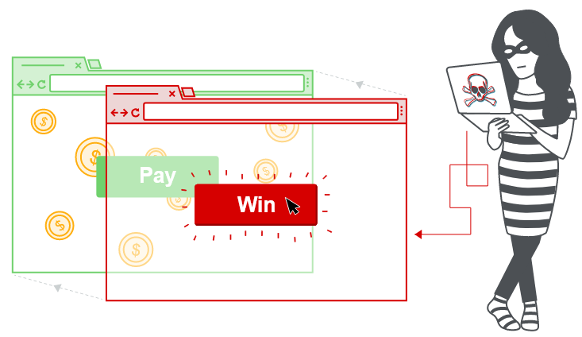

# 1. Định nghĩa

- `Clickjacking` là một cuộc tấn công dựa trên giao diện, trong đó người dùng bị lừa nhấp chuột vào nội dung có thể thực thi trên một trang web ẩn bằng cách nhấp chuột vào một nội dung khác trên một trang web giả mạo. 

***Ví dụ***: người dùng truy cập vào web để nhận giải thưởng nhưng đã bị kẻ tấn công lừa nhấn nút thay thế dẫn đến thanh toán một tài khoản trên một trang web khác.

- Kỹ thuật này sử dụng việc kết hợp nhiều trang web vô hình, có thể thao tác được có chứa một nút hoặc 1 liên kết ẩn, chẳng hạn như `iframe`.

- `CSRF` vs `Clickjacking`

| CSRF | Clickjacking |
| --- | --- |
| Người dùng được yêu cầu thực hiện một hành động như nhấp chuột vào một nút. | Phụ thuộc vào việc giả mạo một yêu cầu hoàn chỉnh mà không cần sự chứng thực hoặc đầu vào của người dùng.|
| Bảo vệ bằng cách sử dụng `CSRF token`, chỉ sử dụng 1 lần và liên quan đến phiên làm việc | Không bị giảm thiểu bởi `CSRF token` vì phiên mục tiêu được thiết lập với nội dung được tải từ một trang web chính thức và tất cả các yêu cầu xảy ra trên tên miền đó.|

# [2. Khai thác](lab/part1.md)

## 2.1. Tấn công Clickjacking đơn giản (lab 1)

- Sử dụng `CSS (z-index, opacity, ...)` và `iframe` phủ lên trang web mồi nhử.

## 2.2. Clickjacking với form được điền sẵn (lab 2)

- Điền trước tham số bằng cách sử dụng method `GET` : `https://url/tham_số=giá_trị`

    ***Ví dụ:*** `https://url/email=test@test`

## 2.3. Frame busting scripts (lab 3)

- Để ngăn chặn các cuộc tấn công `Clickjacking`, các trang web có thể hạn chế sử dụng `iframe`. Tuy nhiên vẫn dễ dàng bị tấn công bằng cách đặt các giá trị `allow-forms` hoặc `allow-scripts` và `allow-top-navigation`.

## 2.4. Kết hợp Clickjacking và DOM XSS (lab 4)

- Việc thực hiện cuộc tấn công kết hợp này tương đối đơn giản với giả định rằng kẻ tấn công đã xác định được việc khai thác XSS trước tiên. Việc khai thác XSS sau đó được kết hợp với URL mục tiêu iframe để người dùng nhấp vào nút hoặc liên kết và do đó thực hiện cuộc tấn công DOM XSS.

## 2.5. Multistep clickjacking (lab 5)

- Đôi khi tấn công cần phải thực hiện nhiều hành động liên tiếp, chẳng hạn như muốn lừa người dùng mua hàng thì trước đó mặt hàng đó cần phải được thêm vào giỏ hàng trước.

# 3. Phòng chống, ngăn chặn

- Ở phần `Khai thác` cũng có 1 cách ngăn chặn là ngăn chặn sử dụng `iframe` tuy nhiên thì cách này rất dễ bypass bởi các giá trị `allow-forms` và `allow-scripts`.

- Hai cơ chế bảo vệ chống `Clickjacking` là:

    - **X-Frame-Options**

    - **Content Security Policy (CSP)**

## 3.1. X-Frame-Options

- Header cung cấp quyền kiểm soát sử dụng `iframe`

    - cấm sử dụng: `X-Frame-Options: deny`

    - giới hạn cùng nguồn gốc với trang web: `X-Frame-Options: sameorigin`

    - cho phép truy cập đến 1 trang web: `X-Frame-Options: allow-from https://normal-website.com`

## 3.2. Content Security Policy (CSP)

- cơ chế phát hiện và ngăn chặn giúp giảm thiểu tấn công XSS và Clickjacking.

- Header có dạng: `Content-Security-Policy: policy`

- Kết hợp với `frame-ancestors`

    - cấm sử dụng: `Content-Security-Policy: frame-ancestors 'none';`

    - giới hạn cùng nguồn gốc: `Content-Security-Policy: frame-ancestors 'self';`

    - cho phép truy cập đến một trang web ``Content-Security-Policy: frame-ancestors normal-website.com;``