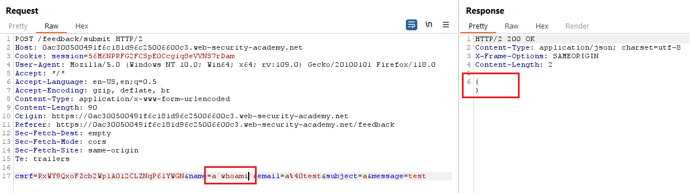
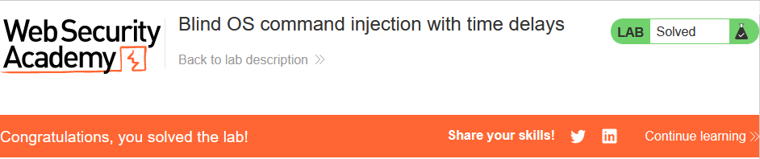

# [Lab 1: OS command injection, simple case](https://portswigger.net/web-security/os-command-injection/lab-simple)

> - **Mô tả lab:** lỗi `Command Injection` trong chức năng `Check stock`, thực thi commmand chứa sản phẩm do người dùng cung cấp và ID của hàng, đồng thời có trả về kết quả trong response.
>
> - **Mục tiêu:** thực thi câu lệnh `whoami` để xác định tên người dùng hiện tại.

Trang web chính, ta chưa thấy chức năng `Check stock`

`View details` thì thấy function lỗi rồi

Tại Request thực hiện `checkStock` ta thấy có sản phẩm và storeID như mô tả, ta chèn thêm command mới thì thực hiện thành công

ngoài ra có thể F12 rồi sửa giá trị và `Check stock`

solve the lab

> **Test bằng Scan**

- chèn command

tuy nhiên ta thấy 3 `echo` giống nhau khó có thể biết lỗi ở `echo` nào, ta có thể test xem nó đúng ở `echo` nào hoặc không thì `whoami` cả 3 echo

# [Lab 2: Blind OS command injection with time delays](https://portswigger.net/web-security/os-command-injection/lab-blind-time-delays)

> - **Mô tả lab:** lỗi `Command Injection` trong chức năng `Feedback`, thực thi commmand chứa thông tin do người dùng cung cấp, đồng thời không trả về kết quả trong response.
>
> - **Mục tiêu:** thực thi câu lệnh làm trễ 10s.

Trang web chính của lab này, và thấy function lỗi `Feedback` rồi

Chức năng chứa lỗi `Command Injection`

Chèn command thử xem thì vẫn submit thành công, tuy nhiên kết quả trả về ta không hề thấy kết quả của command `whoami`

Kích hoạt time delays xem có phản ứng gì không

0k trễ 10s và solve lab

> **Test bằng Active Scan**

# [Lab 3: Blind OS command injection with output redirection](https://portswigger.net/web-security/os-command-injection/lab-blind-output-redirection)

> - **Mô tả lab:** lỗi `Command Injection` trong chức năng `Feedback`, thực thi commmand chứa thông tin do người dùng cung cấp, đồng thời kết quả không được trả về trong response. Tuy nhiên, có thể chuyển hướng kết quả bằng command vào thư mục `/var/www/images/`, có thể dùng URL tải hình ảnh để truy xuất nôi dung của tệp.
>
> - **Mục tiêu:** thực thi câu lệnh `whoami` và trích xuất kết quả.

main web

Chức năng chứa lỗi `Command Injection`

Test thử xem lỗi như thế nào, chèn command đơn giản thì thấy rằng response trả về không hiển thị kết quả của command

Kích hoạt thời gian trễ thì ta thấy web có phản hổi trễ, vậy đây là Blind SQLi rồi

test thử chuyển hướng kết quả của command vào 1 tệp thì thấy thành công nha, ta sẽ dùng nó để bypass bài này

chú ý trang web có những file ảnh sản phẩm và nó được lưu tại `var/www/images/`, ta sẽ chuyển hướng ouput của command `whoami` vào path này và sẽ thay đổi URL đọc file ảnh để trích xuất kết quả

Thay đổi URL để xem file output

solve the lab

> **Test bằng Active Scan**

tìm được lỗi

# [Lab 4: Blind OS command injection with out-of-band interaction](https://portswigger.net/web-security/os-command-injection/lab-blind-out-of-band)

> - **Mô tả lab:** lỗi `Command Injection` trong chức năng `Feedback`, thực thi commmand chứa thông tin do người dùng cung cấp, đồng thời kết quả không được trả về trong response. Thậm chí chuyển hướng đầu ra cũng không được nhưng có thể kích hoạt OOB
>
> - **Mục tiêu:** khai thác để tra cứu DNS cho Burp Collaborator.

Trang web chính và chức năng lỗi `Feedback`

Chức năng chứa lỗi `Command Injection`

test thử thêm command bình thường và kích hoạt thời gian trễ thì ta đều không thấy có ảnh hưởng gì.

try OOB, sử dụng `nslookup` để tìm kiếm DNS cho Burp Collaborator

có phản hồi từ Collaborator

solve the lab

> **Test bằng Active Scan**

# [Lab 5: Blind OS command injection with out-of-band data exfiltration](https://portswigger.net/web-security/os-command-injection/lab-blind-out-of-band-data-exfiltration)

> - **Mô tả lab:** lỗi `Command Injection` trong chức năng `Feedback`, thực thi commmand chứa thông tin do người dùng cung cấp, đồng thời kết quả không được trả về trong response. Thậm chí chuyển hướng đầu ra cũng không được nhưng có thể kích hoạt OOB
>
> - **Mục tiêu:** thực thi `whoami` và trích xuất kết quả thông qua truy vấn DNS với Burp Collaborator và submit kết quả.

tương tự như lab 5, chỉ khác yêu cầu thôi. Thử thực thi `whoami` luôn.

phản hổi từ Collaborator

submit and solve the lab

> **Test bằng Active Scan**

