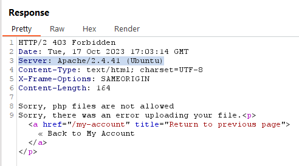

# [Lab 2: Web shell upload via Content-Type restriction bypass](https://portswigger.net/web-security/file-upload/lab-file-upload-web-shell-upload-via-content-type-restriction-bypass)

> - **Mô tả lab:** Lỗi ở chức năng tải lên hình ảnh, cố gắng ngăn người dùng tải lên các loại tệp không mong muốn nhưng dựa vào việc kiểm tra dữ liệu đầu vào do người dùng kiểm soát để xác minh điều này.
> 
> - **Mục tiêu:** tải lên PHP web shell lọc nội dung tệp `/home/carlos/secret` và nộp thông tin.

Vẫn là đăng nhập và thử update 1 file webshell, tuy nhiên thông báo nhận được ta dễ dàng thấy rằng type application/octet-stream đã thấy ở trong Content-Type đã bị chặn và chỉ cho phép type là image/jpeg

Vậy ta sẽ sửa `Content-Type` về `image/jpeg` và thấy đã upload thành công

Vào xem file `(Open image in new tab)` để lấy content

Submit và solve thôi

# [Lab 3: Web shell upload via path traversal](https://portswigger.net/web-security/file-upload/lab-file-upload-web-shell-upload-via-path-traversal)

> - **Mô tả lab:** Lỗi ở chức năng tải lên hình ảnh, ngăn chặn việc thực thi các tệp do người dùng cung cấp, nhưng hạn chế này có thể được vượt qua bằng cách khai thác lỗ hổng `Path Traversal`.
> 
> - **Mục tiêu:** tải lên PHP web shell lọc nội dung tệp `/home/carlos/secret` và nộp thông tin.

Upload 1 file PHP web shell thì vẫn up thành công, 

Tuy nhiên khi ta mở file xem thì thấy nó không được thực thi mà chỉ hiển thị nội dung file

Ta có thế khai thác thêm qua lỗ hổng `Path Traversal`, khi thử `../` thì ra thấy đã bị replace rồi

encode nó để bypass

xem file để lấy content

submit và sovle thôi

# [Lab 4: Web shell upload via extension blacklist bypass](https://portswigger.net/web-security/file-upload/lab-file-upload-web-shell-upload-via-extension-blacklist-bypass)

> - **Mô tả lab:** Lỗi ở chức năng tải lên hình ảnh, một số phần mở rộng tệp nhất định bị đưa vào danh sách đen, nhưng biện pháp bảo vệ này có thể bị bỏ qua do lỗ hổng cơ bản trong cấu hình của danh sách đen này.
> 
> - **Mục tiêu:** tải lên PHP web shell lọc nội dung tệp `/home/carlos/secret` và nộp thông tin.

Tải lên 1 file PHP webshell thì phát hiện bị cấm rồi.

Trong response có tiết lộ về server được sử dụng là `Apache`

Trong máy chủ này có 1 file đặc biệt đó chính là `.htaccess`, file này cho phép cấu hình cụ thể cho các file và thư mục. Chỉ thị `AddType application/x-httpd-php .anything` trong tệp `.htaccess` có ý nghĩa là khi máy chủ web nhận được yêu cầu truy cập vào tệp có phần mở rộng là `.anything`, nó sẽ xử lý tệp đó như là `mã PHP`.

Vậy ta đổi extension `.php` thành `.anything`

`Open image in new tab` xem file, ta đã lấy được content

submit và solve lab

# [Lab 5: Web shell upload via obfuscated file extension](https://portswigger.net/web-security/file-upload/lab-file-upload-web-shell-upload-via-obfuscated-file-extension)

> - **Mô tả lab:** Lỗi ở chức năng tải lên hình ảnh, một số phần mở rộng tệp nhất định bị đưa vào danh sách đen, nhưng biện pháp bảo vệ này có thể bị vượt qua bằng cách sử dụng kỹ thuật che giấu cổ điển.
> 
> - **Mục tiêu:** tải lên PHP web shell lọc nội dung tệp `/home/carlos/secret` và nộp thông tin.

Khi up 1 file PHP thì sẽ bị block và được thông báo chỉ có file `JPG & PNG` là được phép

Đổi `Content-type` cũng không có tác dụng, ta thử thêm extension `.png` vào `filename` thì lại up được bình thường rồi

Vậy ta đoán là web chỉ check `filename` có extension là của file ảnh hay không, ta sẽ sử dụng `NULL BYTE` để sau khi up xong phần sau `NULL BYTE` này sẽ bị bỏ đi và file lúc này sẽ trở thành file PHP

Xem file và lấy content

submit và solve

# [Lab 6: Remote code execution via polyglot web shell upload](https://portswigger.net/web-security/file-upload/lab-file-upload-remote-code-execution-via-polyglot-web-shell-upload)

> - **Mô tả lab:** Lỗi ở chức năng tải lên hình ảnh, mặc dù nó kiểm tra nội dung của tệp để xác minh rằng đó là hình ảnh nhưng vẫn có thể tải lên và thực thi mã phía máy chủ.
> 
> - **Mục tiêu:** tải lên PHP web shell lọc nội dung tệp `/home/carlos/secret` và nộp thông tin.

Web chặn hết các file up lên không phải là file hỉnh ảnh hợp lệ

Check thì không phải do extension hay `Content-Type` mà có thể do `Header` cùa file ảnh, ở `Header` sẽ có metadata để xác nhận nó là file ảnh, chẳng hạn `JFIF`

Nếu không sử dụng công cụ mà tự sửa nội dung file ảnh

Vẫn thành công và lấy được content

Tuy nhiên sẽ có những trường hợp sẽ khiến file ảnh lỗi và không thể thực thi, nên sử dụng công cụ `exiftool` để thêm nội dung vào file và đảm bảo chính xác

Sau khi up file lên thành công thì cũng lấy được content thôi

submit and solve the lab

