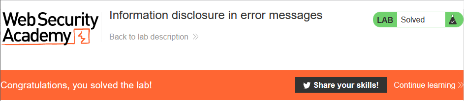
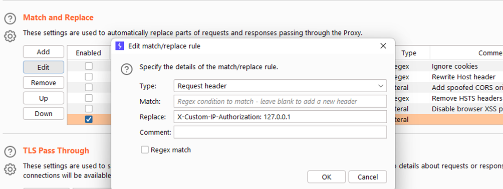
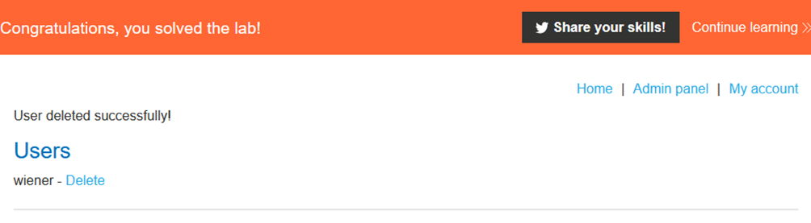

# [Lab 1: Information disclosure in error messages](https://portswigger.net/web-security/information-disclosure/exploiting/lab-infoleak-in-error-messages)

> - **Mô tả lab:** Thông báo lỗi của lab tiết lộ rằng nó sử dụng framework dễ bị tấn công
>
> - **Mục tiêu:** tìm version của framework này.

Trang web chính của ta, có vẻ là trang web bán hàng.

`View details` 1 sản phẩm bất kỳ, ta nhận thấy id là 1 số

sửa thành 1 chữ coi có lỗi gì không

lỗi chắc luôn và ta thấy có xuất hiện framework ở cuối thông báo lỗi

submit version number and solve the lab

# [Lab 2: Information disclosure on debug page](https://portswigger.net/web-security/information-disclosure/exploiting/lab-infoleak-on-debug-page)

> - **Mô tả lab:** Lab này chứa trang debug tiết lộ thông tin nhạy cảm về ứng dụng.
>
> - **Mục tiêu:** submit `SECRET_KEY`

vẫn trang web tương tự như lab trên

quan sát code của trang web ta thấy dòng code đã bị comment dẫn tới `Debug` page `<!-- <a href=/cgi-bin/phpinfo.php>Debug</a> -->`

ngoài ra ta có thể sử dụng `dirsearch` xem có thư mục ẩn nào mà ta có thể truy cập không

go to that endpoint

find `SECRET_KEY`

submit and solve the lab

# [Lab 3: Source code disclosure via backup files](https://portswigger.net/web-security/information-disclosure/exploiting/lab-infoleak-via-backup-files)

> - **Mô tả lab:** Tiết lộ thông tin qua cá tập tin `backup` trong thư mục ẩn.
>
> - **Mục tiêu:** xác định và submit mật khẩu được mã hóa.

cũng không khác gì cũng lab trên lắm

sử dụng `dirsearch` để tìm xem có thư mục ẩn nào mà ta có thể truy cập không

go to that site

submit and solve the lab

# [Lab 4: Authentication bypass via information disclosure](https://portswigger.net/web-security/information-disclosure/exploiting/lab-infoleak-authentication-bypass)

> - **Mô tả lab:** Giao diện `admin` có lỗ hổng bỏ qua xác thực, khai thác về HTTP header.
>
> - **Mục tiêu:** sử dụng HTTP header để bỏ qua xác thực. Truy cập vào giao diện `admin` và xóa tài khoản `carlos`.

web không còn gì lạ nữa

dirsearch ta thấy `/admin` đã bị cấm truy cập

truy cập đến xem giao diện `admin`

thông báo chỉ ra rằng chỉ có thể đăng nhập với các local users

thay đổi method sang `TRACE`

ta thấy response có header author IP, đây là IP của máy mình không phải là IP của local user

giờ ta sẽ đổi thành `127.0.0.1` (local) để gửi request

***Cách 1:*** **Proxy → Options** : cách này giúp ta load lại web với header như hình và sẽ nhanh hơn cách 2 bên dưới.

Trở lại trình duyệt, ta đã thấy xuất hiện admin panel

Truy cập và solve

***Cách 2:*** thêm HTTP Header bên Request

show response in browser thì ta thấy vẫn đường link xóa tài khoản, tuy nhiên bấm xóa thì không được vì IP không phải local

tìm endppoint xóa

thay vào request

thì vẫn solve thôi

# [Lab 5: Information disclosure in version control history](https://portswigger.net/web-security/information-disclosure/exploiting/lab-infoleak-in-version-control-history)

vẫn sử dụng `dirsearch` để tìm các thư mục ẩn, ở đây ta tìm thấy các thư mục `./git`

sử dụng `githack`, tuy nhiên công cụ này chỉ down được các file code thôi

ta thấy có hành động gì đó đối với admin password

tải hết file của trang web về

ta thấy commit có `Remove password`

xem log để coi lịch sử chỉnh sửa: `Remove admin password from config` chi tiết hơn

coi cụ thể log này xem nó remove gì

→ get pass → login → delete user carlos → solve the lab

