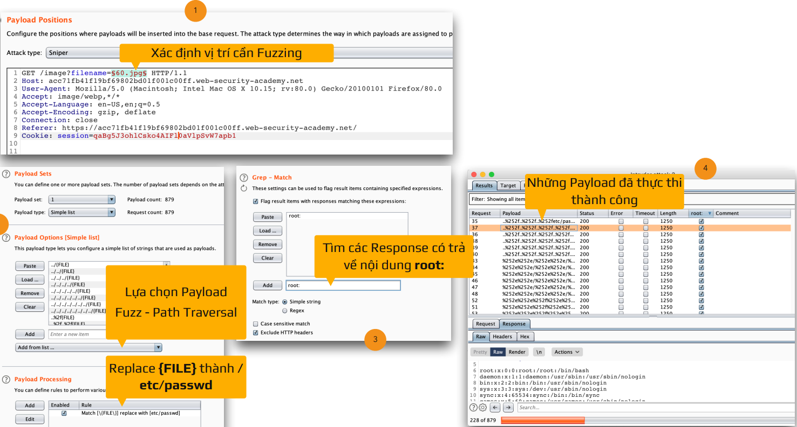
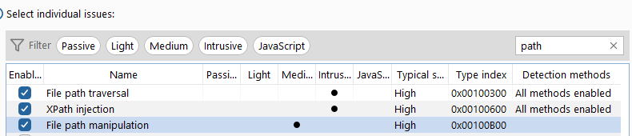

## **_1. Định nghĩa_**

là một lỗ hổng bảo mật web cho phép kẻ tấn công đọc các tệp tùy ý trên máy chủ đang chạy một ứng dụng. Điều này có thể bao gồm mã và dữ liệu ứng dụng, thông tin xác thực cho hệ thống phụ trợ và các tệp hệ điều hành nhạy cảm. Trong một số trường hợp, kẻ tấn công có thể ghi vào các tệp tùy ý trên máy chủ, cho phép chúng sửa đổi dữ liệu hoặc hành vi của ứng dụng và cuối cùng chiếm toàn quyền kiểm soát máy chủ.

## [**_2. How to test_**](./lab/part1.md)

2.1. Đọc các tập tin tùy ý thông qua directory traversal (lab 1)

2.2. Những trở ngại khi khai thác (lab 2, 3, 4, 5, 6)

- Các biến thể của `../`

  - `../`: Sử dụng để di chuyển trên Linux
 
  - `..\`: Sử dụng để di chuyển trên Windows
 
  - `./` : Thư mục hiện tại
 
  - `%2e%2e%2f` : URL Encode `%2e` là dấu chấm, `%2f` là dấu `/`
 
  - `..././` : Sử dụng khi dấu `"../"` bị thay thế bằng `""`
 
  - `..;/` : Sử dụng để bypass trong một số trường hợp

- File extension: sử dụng Null-Byte Bypass

  - Null Byte sẽ chấm dứt một chuỗi (Null Terminator)
 
  - %00, \x00
 
  - Hoạt động với đa số các ngôn ngữ lập trình Perl, PHP, Java, ASP, ASP.Net, C,..

> **NOTE: test nhanh**

> **NOTE: Nếu add Profile để thực hiện Insertion Point Scan thì nên add cả 3**

