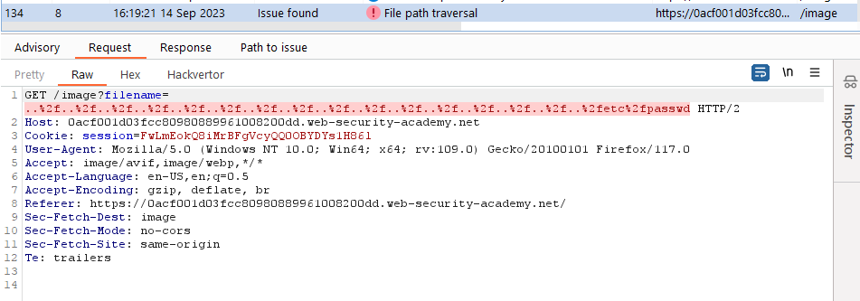
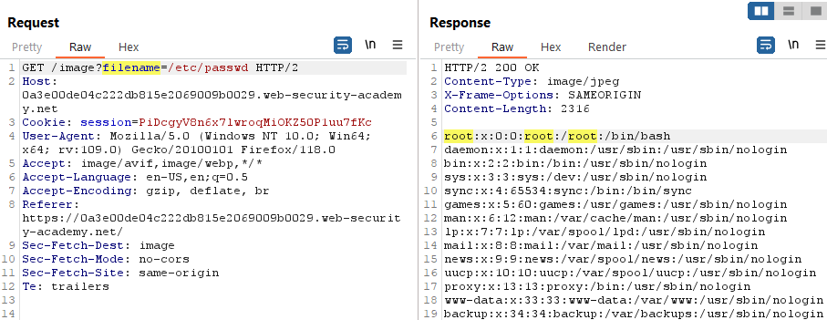
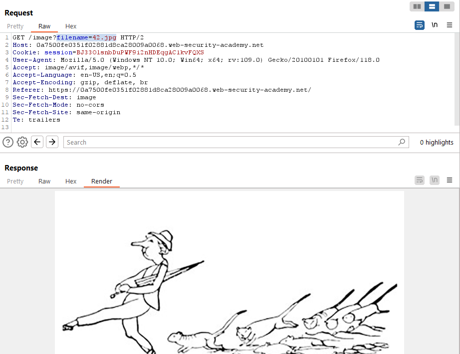

# [Lab 1: File path traversal, simple case](https://portswigger.net/web-security/file-path-traversal/lab-simple)

> - **Mô tả lab:** Lỗi `Path traversal` trong hiển thị hình ảnh sản phẩm.
>
> - **Mục tiêu:** trích xuất contents file `/etc/passwd`.

Trang web chính có rất nhiều hình ảnh sản phẩm

hãy bật `Images` để xem các path đến image nữa vì trang có rất nhiều image và sẽ có directory lưu trữ nó

Quan sát các Request chứa hình ảnh sản phẩm của web

test thôi

response trả về `No such file` --> directory hiện không có thư mục --> lùi thư mục đến chỗ đọc được thì thôi

đã tìm ra

xem trên web lỗi không thể hiển thị nên ta sẽ xem bằng Response trên burp suite

ok solve the lab

> **Test bằng Active Scan**

# [Lab 2: File path traversal, traversal sequences blocked with absolute path bypass](https://portswigger.net/web-security/file-path-traversal/lab-absolute-path-bypass)

> - **Mô tả lab:** lỗi `Path traversal` trong hiển thị hình ảnh sản phẩm, chặn các chuỗi truyền tải nhưng coi tệp được cung cấp có liên quan đến thư mục làm việc mặc định.
>
> - **Mục tiêu:** truy xuất contents của `/etc/passwd`.

Trang web chính của lab có rất nhiều hình ảnh sản phẩm

Quan sát các Request chứa hình ảnh sản phẩm của web

Thử với đường dẫn tuyệt đối trước thì đọc được file luôn rồi

solve lab luôn

> **Test bằng Active Scan**

# [Lab 3: File path traversal, traversal sequences stripped non-recursively](https://portswigger.net/web-security/file-path-traversal/lab-sequences-stripped-non-recursively)

> - **Mô tả lab:** lỗi như các lab, tuy nhiên có loại bỏ các chuỗi truyền tải khỏi nội dung tệp trước khi sử dụng
>
> - **Mục tiêu:** truy xuất contents của `/etc/passwd`.

Trang web chính của lab chứa rất nhiều hình ảnh sản phẩm

Quan sát các Request chứa hình ảnh sản phẩm của web

thử thêm `../` vào `filename` để lùi đến thư mục khác, ta phát hiện ảnh vẫn hiển thị bình thường, ta đoán là đã bị kiểm soát đầu vào rồi và bị replace

Ta sẽ đổi thành `....//` để khi mất 1 `../` ta vẫn còn 1 `../`, và ảnh đã không tồn tại `No such file`, vậy là bypass được rồi

Đọc `/etc/passwd` thôi

solve the lab

> **Test bằng Active Scan**

# [Lab 4: File path traversal, traversal sequences stripped with superfluous URL-decode](https://portswigger.net/web-security/file-path-traversal/lab-superfluous-url-decode)

> - **Mô tả lab:** lỗi `Path traversal` trong hiển thị hình ảnh sản phẩm, tuy nhiên có chặn các chuỗi truyền tải đường dẫn, sau đó thực hiện giải mã URL của đầu vào trước khi sử dụng.
>
> - **Mục tiêu:** truy xuất contents của `/etc/passwd`.

Trang web chính của lab có chứa rất nhiều hình ảnh sản phẩm

Quan sát các Request chứa hình ảnh sản phẩm của web

encode 1 lần, thì có thể bị giải mã rồi block luôn `../`

encode lần nữa là thành công rồi

bypass thôi

ok solve the lab

> **Test bằng Active Scan**

# [Lab 5: File path traversal, validation of start of path](https://portswigger.net/web-security/file-path-traversal/lab-validate-start-of-path)

> - **Mô tả lab:** lỗi `Path traversal` trong hiển thị hình ảnh sản phẩm, tuy nhiên đường dẫn tệp phải đầy đủ và sẽ xác thực nó bắt đầu bằng đường dẫn đó.
>
> - **Mục tiêu:** truy xuất contents của `/etc/passwd`.

Trang web chính của lab có chứa rất nhiều hình ảnh sản phẩm

Quan sát các Request chứa hình ảnh sản phẩm của web

ta thấy, nó luôn bắt đầu bằng `/var/www/images/`, vậy ta sẽ thêm `../` vào sau đường dẫn này, kết quả là thành công rồi nên file sẽ không tồn tại

`var` và `etc` thường cùng ở `/` nên ta dùng `../../../` để đọc `/etc/passwd`

solve the lab

> **Test bằng Insertion Point**

# [Lab 6: File path traversal, validation of file extension with null byte bypass](https://portswigger.net/web-security/file-path-traversal/lab-validate-file-extension-null-byte-bypass)

> - **Mô tả lab:** lỗi `Path traversal` trong hiển thị hình ảnh sản phẩm, tuy nhiên xác thực tên tệp được cung cấp kết thúc bằng extension dự kiến.
>
> - **Mục tiêu:** truy xuất contents của `/etc/passwd`.

Trang web chính của lab có chứa rất nhiều hình ảnh sản phẩm

Quan sát các Request chứa hình ảnh sản phẩm của web

Lab này check extension nên ta sẽ dùng `NULL BYTE` để loại bỏ nó đi và đương nhiên là vẫn phải lùi

solve the lab

> **Test bằng Active Scan**

