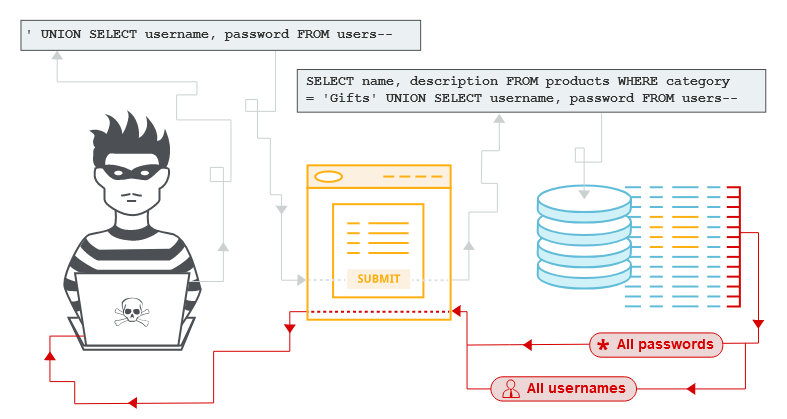

# **1. SQLi là gì?**

- **SQLi** là một lỗ hổng bảo mật web cho phép kẻ tấn công can thiệp vào các truy vấn mà ứng dụng thực hiện đối với cơ sở dữ liệu của nó. Nó thường cho phép kẻ tấn công xem dữ liệu mà thông thường họ không xem được, thậm chí kẻ tấn công có thể sửa đổi hoặc xóa dữ liệu này, gây ra ảnh hưởng nghiêm trọng.

# **2. Ảnh hưởng**

- Vượt qua cơ chế xác thực (Đăng nhập không cần tài khoản và mật khẩu)

- Thu thập thông tin nhạy cảm trong cơ sở dữ liệu, chẳng hạn như mật khẩu, thông tin người dùng, ...
- Thay đổi tính toàn vẹn của cơ sở dữ liệu (Insert, Update, Delete, Drop)
- Đọc các tệp tin trên máy chủ (Read File Local)
- Tạo ra các Backdoor, Webshell trên máy chủ (Write File Local)
- Thực thi lệnh hệ thống

# **3. Cách phát hiện lỗ hổng SQLi**

***Step 1.*** Xác định các vị trí có thao tác với cơ sở dữ liệu:` Đăng ký, đăng nhập, liên hệ, tìm kiếm, tìm kiếm có filter, chỉnh sửa, xóa dữ liệu, comment, articles, upload, ...`

***Step 2.*** Tìm kiếm các tham số không được xử lý an toàn

- Cách tìm:

  - Đưa các kí trị đặc biệt như: `', ", @, #, -- -`

  - Sử dụng các toán tử cho các tham số là giá trị là số

  - Sử dụng các kiểm tra giá trị đúng và giá trị sai

  - Sử dụng nhiều Payload khác nhau để thực hiện tìm kiếm

- Dữ liệu hiển thị khác với Request ban đầu

  - Trang không tồn tại

  - Trả về HTTP Status khác ban đầu

  - Dữ liệu hiển thị thông tin khác (Sản phẩm trước đó, hoặc sản phẩm khác, 
  hoặc không có thông tin gì về sản phẩm)

  - Hoặc các dấu hiệu bất thường khác như Nội dung và Độ dài của Response

- Thông báo lỗi của ứng dụng

  - Syntax Error của cơ sở dữ liệu

  - Application Error

  - Thời gian phản hồi bị chậm

***Step 3.*** Xác định loại cơ sở dữ liệu mà Website sử dụng

- Dựa vào việc thu thập thông tin

- Dựa vào thông báo lỗi trả về

- Sử dụng các function dành riêng cho từng loại cơ sở dữ liệu

***Step 4.*** Xác định kiểu khai thác phù hợp

***Step 5.*** Khai thác thông tin

# **4. Các vị trí phổ biến**

- UPDATE: `WHERE` clause

- INSERT: insert values

- SELECT: table or column name, `ORDER BY` clause

# **5. Các dạng SQLi phổ biến**

## [5.1. Ví dụ về SQLi](./lab/part1.md)

- Truy xuất dữ liệu ẩn (lab 1)

- Phá vỡ logic ứng dụng (lab 2)

- Truy xuất dữ liệu từ bảng khác

## [5.2. Kiểm tra database](./lab/part2.md)

- Syntax, Comments, error message...

- Truy vấn loại và phiên bản cơ sở dữ liệu (lab 3, 4)

- Liệt kê nội dung của cơ sở dữ liệu (lab 5, 6)

## [5.3. UNION attacks](./lab/part3.md)

- Dữ liệu trả về trong dạng đầy đủ, hoặc nằm trong thông báo lỗi, hoặc nằm trong nội dung của trang web

- Sử dụng câu lệnh `UNION` của CSDL để nối câu lệnh trước và câu lệnh sau, phục vụ cho việc khai thác dữ liệu. Khi sử dụng cần lưu ý về số lượng cột và kiểu dữ liệu.

> Xác định số cột (lab 7)

- Tìm data: tên bảng, tên cột (lab 8, 9)

> Để loại bỏ bớt các dữ liệu trả về hoặc làm sạch dữ liệu trả về, thì hãy làm cho câu truy vấn trước đó trả về dữ liệu rỗng bằng các điều kiện không tồn 
tại bản ghi trong bảng. Ví dụ, NULL, 0, -1, 99999999, AND 1=2

- Khai thác dữ liệu

> Truy xuất nhiều giá trị trong 1 cột (lab 10)

- Error-based.

## [5.4. Blind SQLi](./lab/part4.md)

- **Blind SQLi** là gì?

  - Dữ liệu trả về từng phần (từng ký tự), hoặc trả về dưới dạng True/False, hoặc dưới dạng thời gian phản hồi, hoặc dạng khác biệt dữ liệu.

  - Để đoán được cần có điều kiện:

    - Chiều dài của dữ liệu

    - Xác định từng ký tự

- Boolean

  - Khai thác bằng cách kích hoạt các phản hồi có điều kiện (lab 11)

  - Khai thác bằng cách kích hoạt các lỗi có điều kiện (lab 12)

  - Trích xuất dữ liệu nhạy cảm thông qua các thông báo lỗi SQL (lab 13)

- Time-based

  - Khai thác tính năng Blind SQLi bằng cách kích hoạt độ trễ thời gian (lab 14, 15)
  
- OOB: Khai thác sử dụng OOB (lab 16, 17)

- [SQLi in different contexts (lab 18)](./lab/part4.md#lab-18-sqli-with-filter-bypass-via-xml-encoding)
