# [Lab 1: SQLi vulnerability in `WHERE` clause allowing retrieval of hidden data](https://portswigger.net/web-security/sql-injection/lab-retrieve-hidden-data)

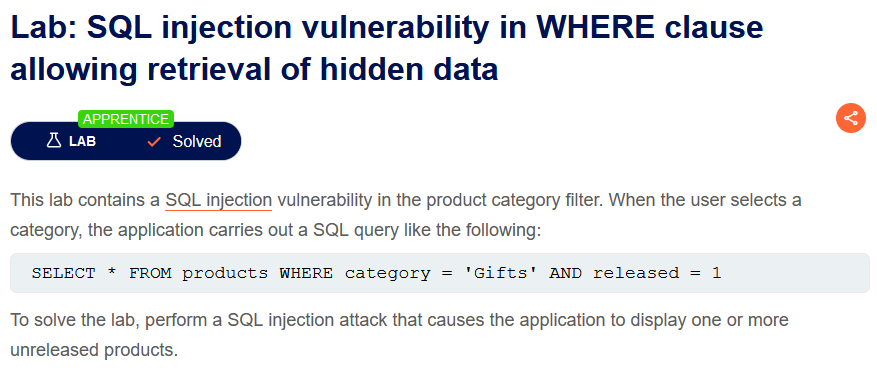

> - **Mô tả lab**: Lỗi SQLi tại ***category filter***.
> 
> - QUERY được sử dụng: `SELECT * FROM products WHERE category = 'Gifts' AND released = 1`
> 
> - **Mục tiêu:** Chèn SQL để hiển thị >=1 sản phẩm unreleased.

Đây là trang web chính của bài lab, ta dễ thấy các chức năng

- `Home`: trở về trang chính

- `Category`: lọc các kết quả tìm kiếm

- `View details`: xem thông tin sản phẩm

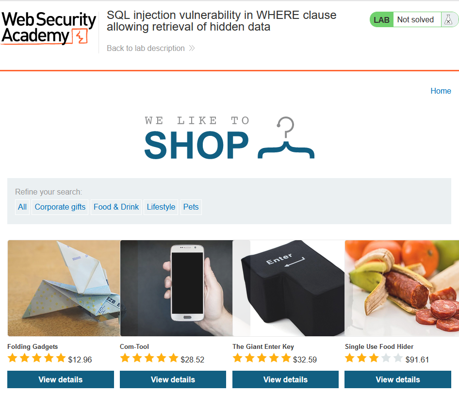

Lỗi SQLi tại `filter`

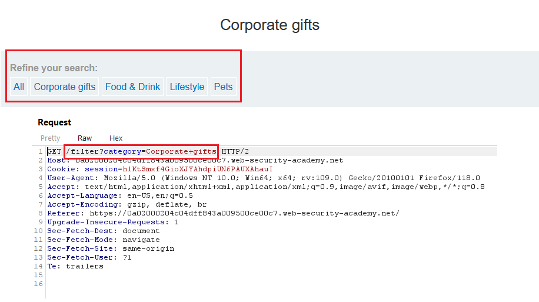

Quan sát response: lỗi `500 Internal Server Error`

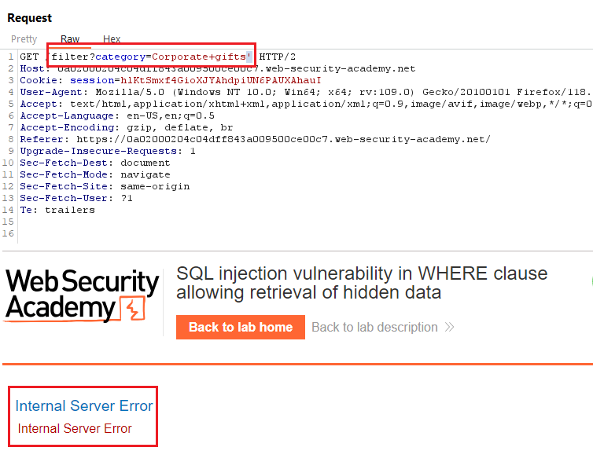

Khi thêm `--` thì lại duyệt web bình thường

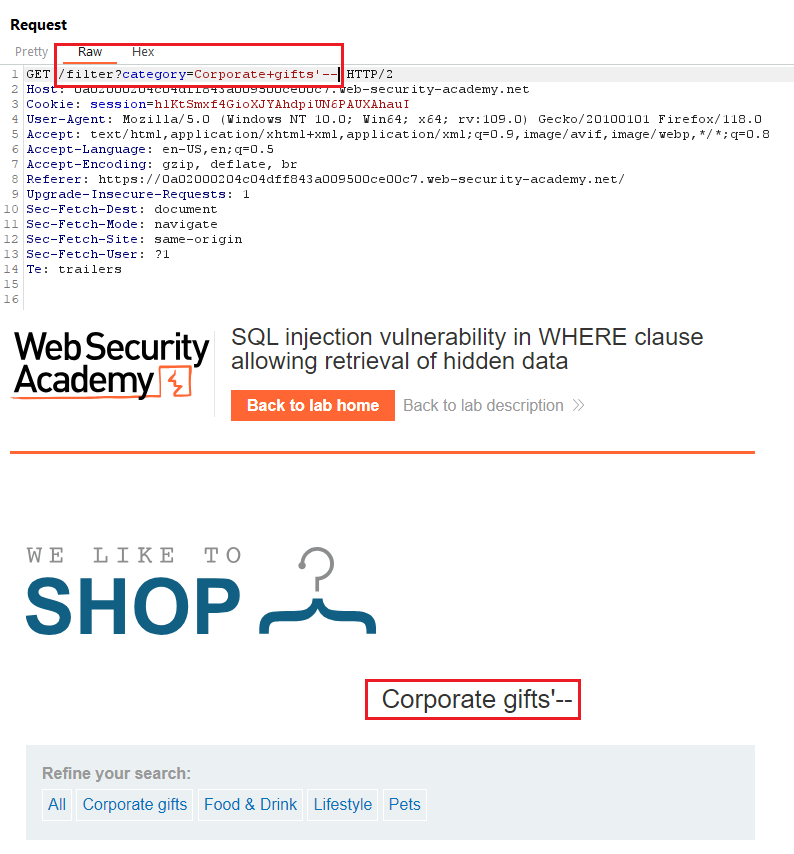

Sau khi đã xác định lỗi SQLi, ta sẽ truy xuất các dữ liệu ẩn bằng cách thêm `OR 1=1`, khi đó QUERY sẽ trở thành `SELECT * FROM products WHERE category = 'Gifts' OR 1=1 -- ' AND released = 1` và sẽ hiện tất cả các danh mục.

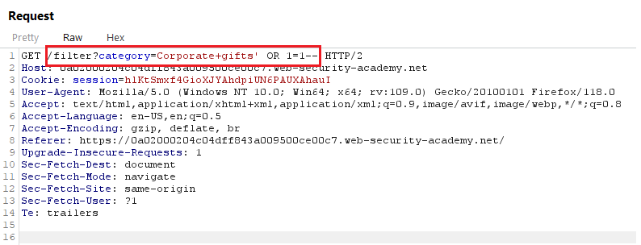

solve the lab

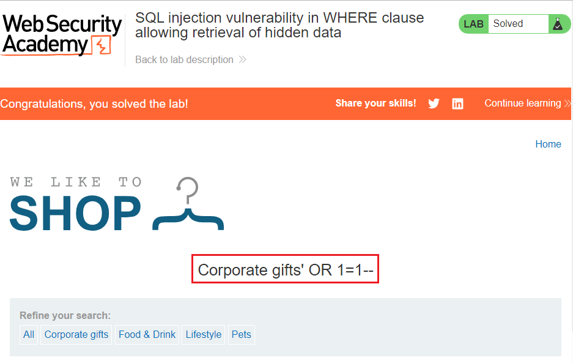

# [Lab 2: SQL injection vulnerability allowing login bypass](https://portswigger.net/web-security/sql-injection/lab-login-bypass)

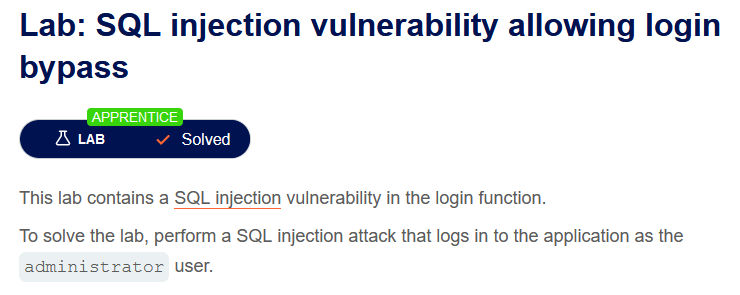

> - **Mô tả lab:** Lỗi SQLi ở chức năng `Login`
>
> - **Mục tiêu:** login với user `administrator`

Đây là trang web chính của bài lab, ta thấy các chức năng

- `Home`

- `View details`

- `My account`: thông tin tài khoản

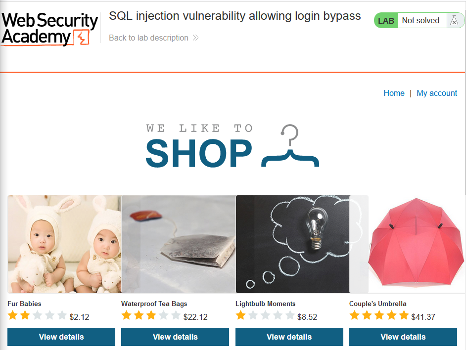

Go to `My account`, đây là function chứa lỗi SQLi, ta sẽ tìm cách chèn SQL để bypass login

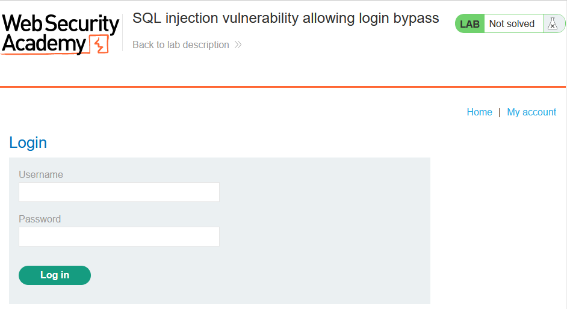

Khi đăng nhập ta quan sát request, đoán rằng QUERY được sử dụng có dạng: `SELECT * FROM users WHERE username = 'administrator' AND password = 'a'`

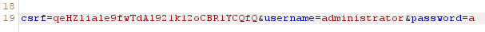

Thêm `'--` sau username, lúc này QUERY sẽ là `SELECT * FROM users WHERE username = 'adnministrator'--' AND password = 'a'` → phần nhận password đã bị comment nên không thể thực hiện.

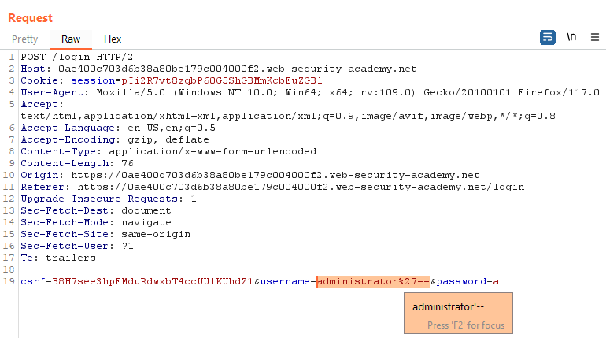

solve the lab

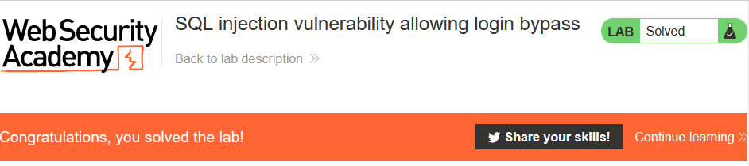