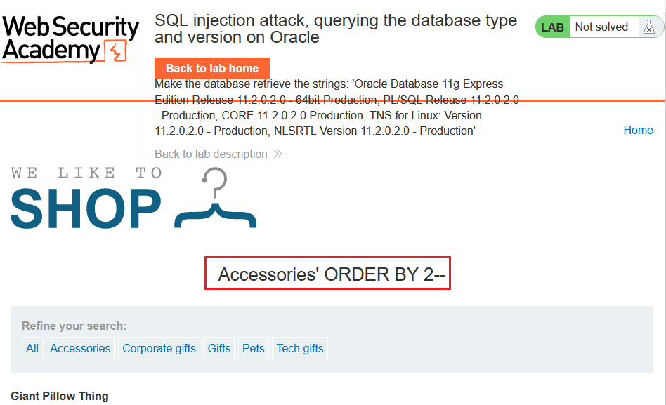
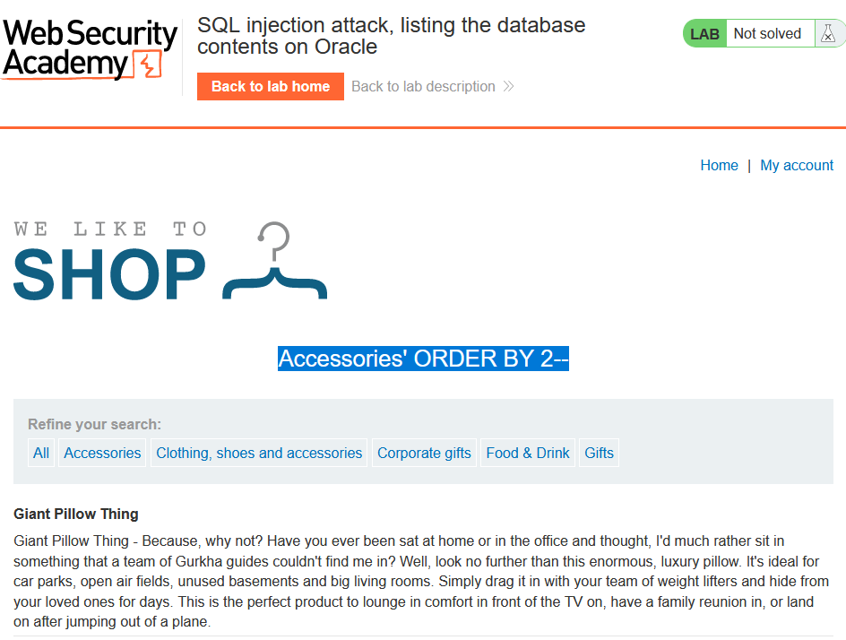

# [Lab 3: SQLi attack, querying the database type and version on Oracle](https://portswigger.net/web-security/sql-injection/examining-the-database/lab-querying-database-version-oracle)

**_Hint_**

> - **Mô tả lab**: Lỗi SQLi tại ***category filter***. Có thể sử dụng `UNION` attack để trả về kết quả của query.
>
> - **Database:** Oracle
>
> - **Mục tiêu:** Hiển thị version và database nhận về chuỗi `'Oracle Database 11g Express Edition Release 11.2.0.2.0 - 64bit Production, PL/SQL Release 11.2.0.2.0 - Production, CORE 11.2.0.2.0 Production, TNS for Linux: Version 11.2.0.2.0 - Production, NLSRTL Version 11.2.0.2.0 - Production'`

test thử lỗi SQL

lỗi `500 Error` rồi

thêm `--` hết lỗi rồi

ta cần xác định số cột để có thể sử dụng `UNION` attack để trích xuất dữ liệu

ok, vậy là có 2 cột, giờ ta sẽ lấy version

solve the lab

> Test bằng tool thử nhỉ, sử dụng Scan để quét lỗi

# [Lab 4: SQLi attack, querying the database type and version on MySQL and Microsoft](https://portswigger.net/web-security/sql-injection/examining-the-database/lab-querying-database-version-mysql-microsoft)

**_Hint_**

> - **Mô tả lab:** tương tự **lab3** nhưng khác database.
>
> - **Database:** MySQL và Microsoft.
>
> - **Yêu cầu:** nhận được chuỗi `8.0.34-0ubuntu0.20.04.1`

như **lab3** thôi, solve the lab

> Scan thì cũng tương tự **lab3**

# [Lab 5: SQLi attack, listing the database contents on non-Oracle databases](https://portswigger.net/web-security/sql-injection/examining-the-database/lab-listing-database-contents-non-oracle)

**_Hint_**

> - **Mô tả lab:** vẫn lỗi như 2 lab trên.
>
> - **Database:** non-Oracle, table (username, password), xác định tên của bảng này và lấy thông tin.

Xác định vị trí lỗi

đích thị là lỗi SQLi

vẫn là xác định số cột để sử dụng `UNION` attack → xác định được có 2 cột

Lấy tên các bảng sử dụng `UNION` attack: `UNION SELECT table_name,NULL FROM information_schema.tables` , sử dụng điều kiện `WHERE table_schema='public'` để chỉ trích xuất các bảng của người dùng

Tìm được tên bảng `users_arryev`

Lấy tên các cột từ bảng vừa tìm được

2 cột `password_dlrfug` và `username_swlkik`

giờ là lấy dữ liệu

lấy được tài khoản của admin là `administrator:vspma1lmgqdohrel5t73`

login and solve the lab

# [Lab 6: SQLi attack, listing the database contents on Oracle](https://portswigger.net/web-security/sql-injection/examining-the-database/lab-listing-database-contents-oracle)

**_Hint_**

> - **Mô tả lab:** vẫn tương tự lab 5, chỉ khác database, ở lab này là `Oracle`.

main web, ta thấy chức năng lỗi `catogory filter`

test

ok, đích thực là lỗi SQLi rồi

tìm số cột, vẫn là có 2 cột

tìm các bảng từ người dùng

tìm được table `USERS_BFEMJV`

tìm được tên các cột

2 cột là `USERNAME_IHWYMM` và `PASSWORD_OKJFKD`

lấy dữ liệu

lấy được tài khoản của admin là `administrator:nz3k2k4ibc83tph6ql42`

login and solve the lab

