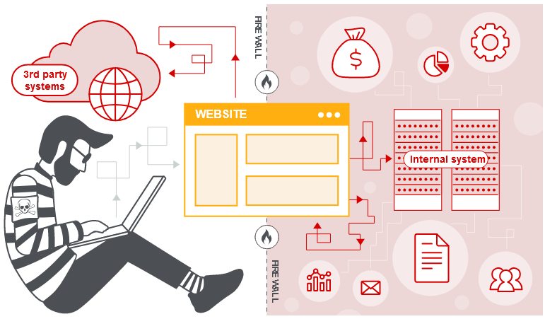

# 1. Định nghĩa

- **Lợi dụng máy chủ** để thực hiện một hành động bất chính.

- Các Request được gửi đi từ phía **Server-Side.**

# 2. Impact

- Thực hiện Scan Port

- Thực hiện Brute Force Credential (Services)

- Thực hiện truy cập vào các hệ thống nội bộ

    - Internal Domain

    - Internal URL

    - Internal Service

- Lợi dụng để tấn công DoS hoặc DDoS

- Thực thi Shell Script trên máy chủ (Phụ thuộc vào các dịch vụ đang có trên hệ thống)

    - Memcached get shell

    - Redis get shell

    - PHP-FPM universal SSRF bypass safe_mode/disabled_functions/o exp

- Truy vấn, đọc các tệp tin nhạy cảm trên máy chủ

    - Logs file

    - trace.axd (Debug file trong ASP.Net)

- Vượt qua ACL của Firewall

    - Bypass whitelist domain

# [3. Common SSRF Attacks](./lab/part1.md)

- Tấn công SSRF vào chính máy chủ (lab 1)

    - cung cấp URL là tên máy chủ: `127.0.0.1` hoặc `localhost`

- SSRF attacks against other back-end systems (lab 2)

- Bypass

    - SSRF with blacklist-based input filters (lab 3)

        - Bypass IP

                http://0/
                http://0.0.0.0/
                http://127.1
                http://127.0.1
                http://0177.0.0.1/
        
        - Bypass using a decimal IP location
        
                http://2130706433/ = http://127.0.0.1
                http://3232235521/ = http://192.168.0.1
                http://3232235777/ = http://192.168.1.1

    - SSRF with whitelist-based input filters (lab 4 EXPERT)

    - Thông qua open redirect (lab 5)

- Blind SSRF

    - OOB (lab 6)

    - (lab 7 EXPERT)

# 4. Phòng chống

- Sử dụng Whitelist
    - Domain
    - Protocol
    - Kiểm tra URL Redirect

- Loại bỏ các Protocol không có trong mục đích sử dụng

        file:///
        dict://
        ftp://
        gopher://

- Áp dụng Authentication cho các Internal Services/ Domain/ URL

- Cẩn trọng trong việc xử lý HTTP Response, tránh bị leak dữ liệu

- Chặn các truy cập từ hệ thống bên trong ra ngoài môi trường Internet (Out-going)