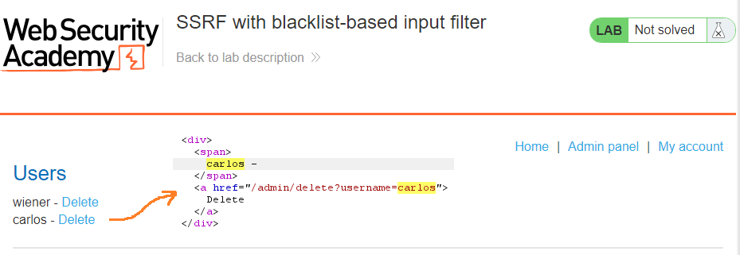
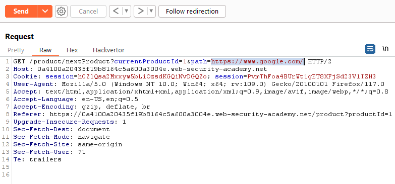

# [Lab 1: Basic SSRF against the local server](https://portswigger.net/web-security/ssrf/lab-basic-ssrf-against-localhost)

> - **Mô tả lab:** Có tính năng `Check stock` để lấy dữ liệu từ hệ thống nội bộ.
> 
> - **Mục tiêu:** thay đổi URL kiểm tra kho để truy cập vào giao diện quản trị tại `http://localhost/admin` và xóa người dùng `carlos`.

chức năng `Check stock`, ta thấy nó sẽ gọi đến 1 URL mới để lấy thông tin sản phẩm → có URL ta nghĩ ngay đến lỗi `SSRF`

giờ ta sẽ gọi đến `/admin`

kết quả là thành công luôn

giờ thì delete `carlos`

solve lab

# [Lab 2: Basic SSRF against another back-end system](https://portswigger.net/web-security/ssrf/lab-basic-ssrf-against-backend-system)

> - **Mô tả lab:** Có tính năng `Check stock` để lấy dữ liệu từ hệ thống nội bộ.
> 
> - **Mục tiêu:** Quét `192.168.0.X:8080` tìm giao diện quản trị viên, xóa `carlos`.

vẫn lỗi như **lab 1** nhưng URL có chút khác, và yêu cầu của bài chỉ cần quét trong `192.168.0.X` với port `8080`

ta sẽ test 1 địa chỉ IP bất kỳ để xem response trả về như thế nào

→ lỗi `500 Error`

Tìm `X` sử dụng `Intruder`

1. **Payload:** `Number` `1 - 256`

2. có thể **Grep Match** với `carlos` hoặc chú ý `Status code`

result tìm được địa chỉ IP thỏa mãn là `192.168.0.122`

chú ý đường dẫn đến để delete `carlos`

delete

solve

# [Lab 3: SSRF with blacklist-based input filter](https://portswigger.net/web-security/ssrf/lab-ssrf-with-blacklist-filter)

> - **Mô tả lab:** Có tính năng `Check stock` để lấy dữ liệu từ hệ thống nội bộ. Có triển khai hai biện pháp phòng thủ chống SSRF yếu mà bạn sẽ cần phải vượt qua.
> 
> - **Mục tiêu:** thay đổi URL kiểm tra kho để truy cập vào giao diện quản trị tại `http://localhost/admin` và xóa người dùng `carlos`.

vẫn lỗi như **lab 1, 2**, khi test các URL `127.0.0.1` hoặc `localhost` thì đều sẽ gặp lỗi 400 vì đã bị block

Tuy nhiên có thể bypass bằng cách sử dụng `127.1`

Nhưng khi truy cập `/admin` thì lại tiếp tục bị block

Bypass bằng doubleURLencode

Truy cập được giao diện quản trị, chú ý path xóa `carlos`

xóa `carlos`

solve lab

# [Lab 5: SSRF with filter bypass via open redirection vulnerability](https://portswigger.net/web-security/ssrf/lab-ssrf-filter-bypass-via-open-redirection)

> - **Mô tả lab:** Có tính năng `Check stock` để lấy dữ liệu từ hệ thống nội bộ. Trình `Check stock` đã bị hạn chế chỉ truy cập vào ứng dụng cục bộ, vì vậy trước tiên bạn cần tìm một chuyển hướng mở ảnh hưởng đến ứng dụng.
> 
> - **Mục tiêu:** thay đổi URL kiểm tra kho để truy cập vào giao diện quản trị tại `http://192.168.0.12:8080/admin` và xóa người dùng `carlos`.

khác những lab trên, lab này có thêm chức năng `Next product` sẽ redirect sang trang khác được đề cập trong `path`

quan sát request thấy có `path` và status code khi send request là `302` là redirect đến trang sản phẩm 2

đổi thành URL bất kỳ coi sao nhé

follow redirection, đã chuyển ta đến sang host google thành công

→ ta sẽ dùng nó để redirect tới địa chỉ mà chúng ta cần đó là `http://192.168.0.12:8080/admin`

vẫn như các lab trên thì vẫn sẽ là lỗi ở `checkStock`, tuy nhiên ở đây lại dùng `path` thay vì URL như các lab trên

giờ ta sẽ thay đổi `path` thành path ở phần `Next product` trên để thực hiện redirect, thay đổi path thành địa chỉ được cung cấp để thực hiện yêu cầu

truy cập được vào trang quản trị

delete

solve

# [Lab 6: Blind SSRF with out-of-band detection](https://portswigger.net/web-security/ssrf/blind/lab-out-of-band-detection)

> - **Mô tả lab:** Trang web này sử dụng phần mềm phân tích để tìm URL được chỉ định trong tiêu đề `Referer` khi trang sản phẩm được tải.
> 
> - **Mục tiêu:** Tạo yêu cầu HTTP tới máy chủ `Burp Collaborator`.

mục đích của lab này đơn giản chỉ là tạo yêu cầu request HTTP tới máy chủ `Burp Collaborator`

Poll now để xem thành công chưa

solve lab

