# [Lab 1: Exploiting XXE using external entities to retrieve files](https://portswigger.net/web-security/xxe/lab-exploiting-xxe-to-retrieve-files)

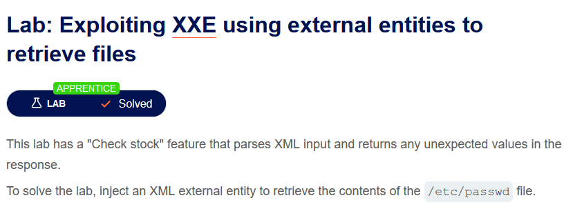

> - **Mô tả lab:** Tính năng `Check stock` để phân tích dữ liệu đầu vào XML và trả về mọi giá trị không mong muốn trong phản hồi.
> 
> - **Mục tiêu:** chèn thực thể XML đọc file `/etc/passwd`.

Chức năng `Check stock` với đầu vào XML

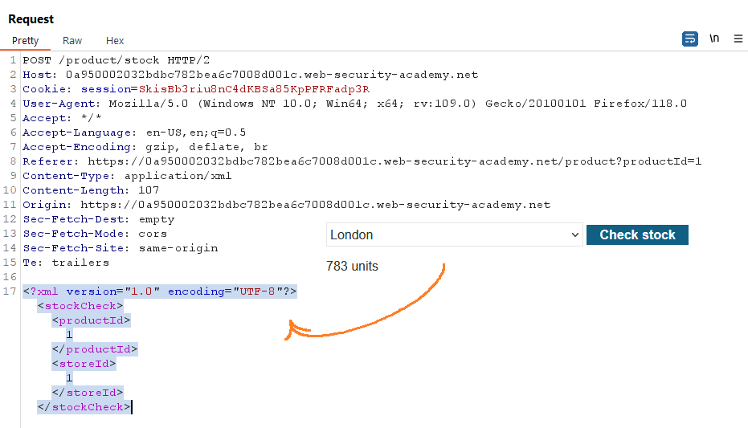

Chèn thực thể đọc file `/etc/passwd`

- Khai báo thực thể để đọc file `/etc/passwd`: `<!DOCTYPE foo [ <!ENTITY xxe SYSTEM "file:///etc/passwd"> ]>`

- gọi thực thế: `&xxe;`

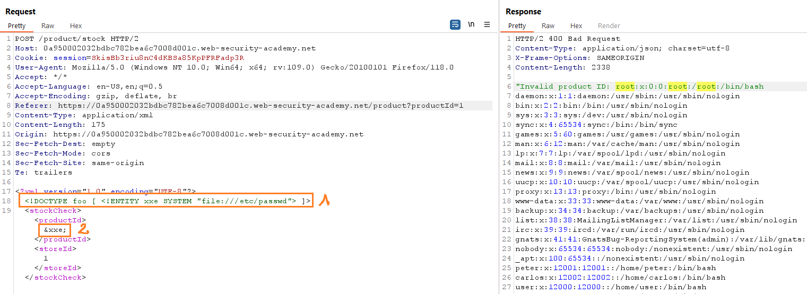

solve lab

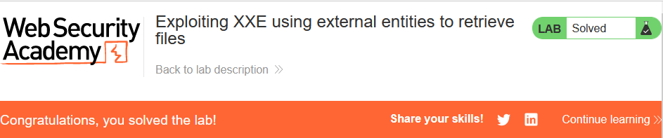

> **Test bằng Active Scan**

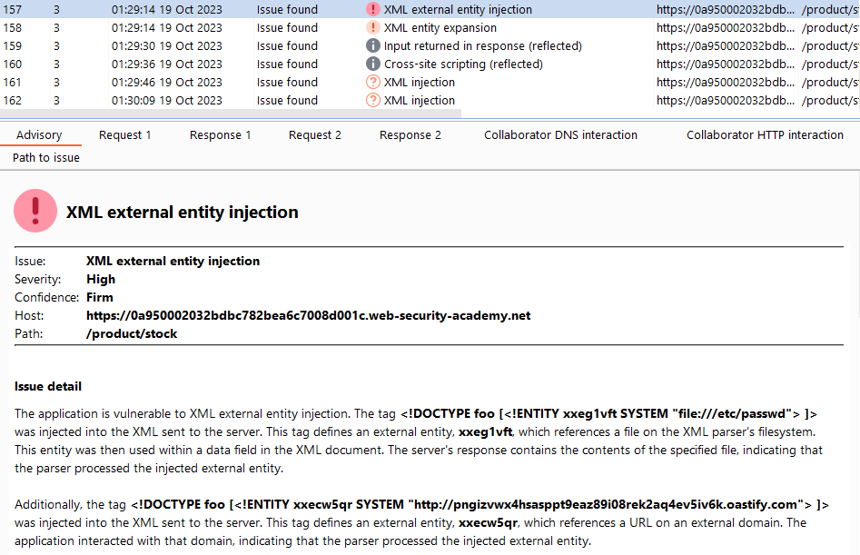

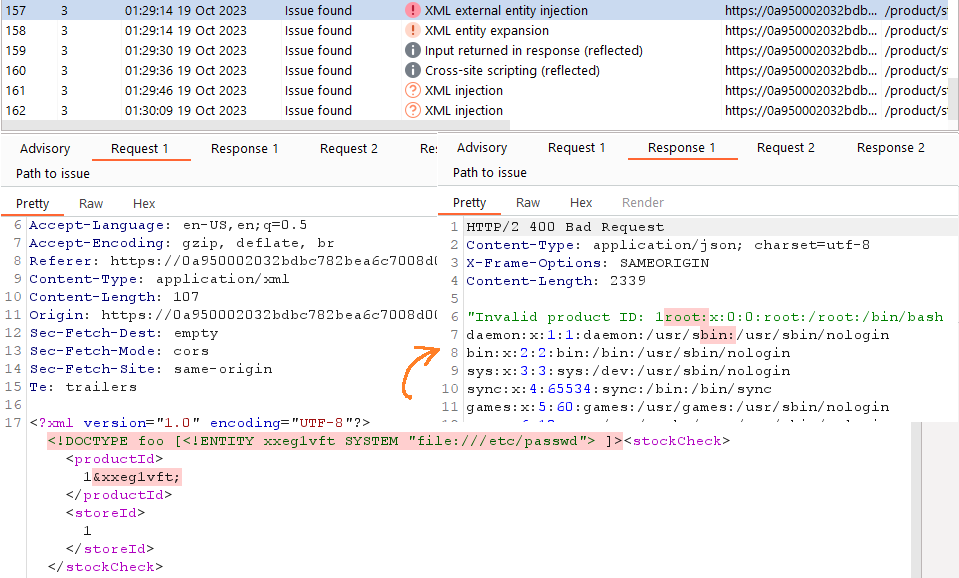

# [Lab 2: Exploiting XXE to perform SSRF attacks](https://portswigger.net/web-security/xxe/lab-exploiting-xxe-to-perform-ssrf)

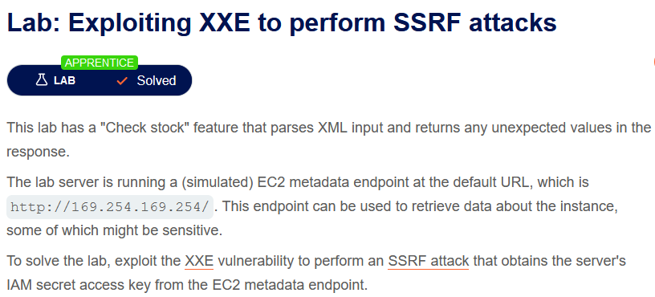

> - **Mô tả lab:** Tính năng `Check stock` để phân tích dữ liệu đầu vào XML và trả về mọi giá trị không mong muốn trong phản hồi. Máy chủ lab đang chạy endpoint `EC2 metadata` tại URL `http://169.254.169.254/`, endpoint này có thể được sử dụng để truy xuất dữ liệu về phiên bản, một trong số đó có thể nhạy cảm.
> 
> - **Mục tiêu:** Khai thác lỗ hổng XXE để thực hiện tấn công SSRF nhằm lấy khóa truy cập bí mật IAM từ endpoint trên.

Chức năng `Check stock` với đầu vào XML

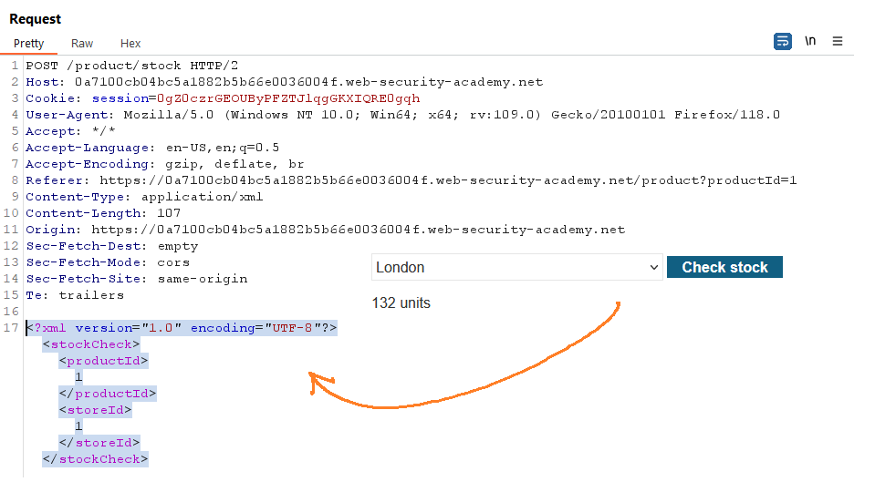

Chèn XML để thực hiện tấn công SSRF với URL mục tiêu: `http://169.254.169.254/`

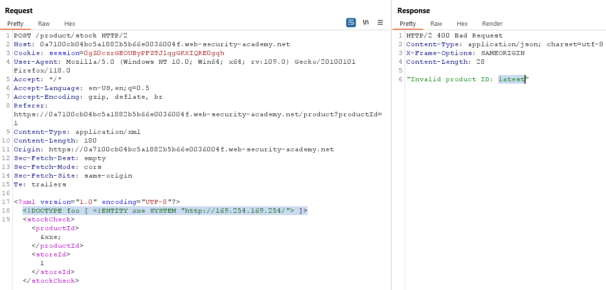

Truy cập đến endpoint trên, lại tìm ra endpoint mới là `meta-data`

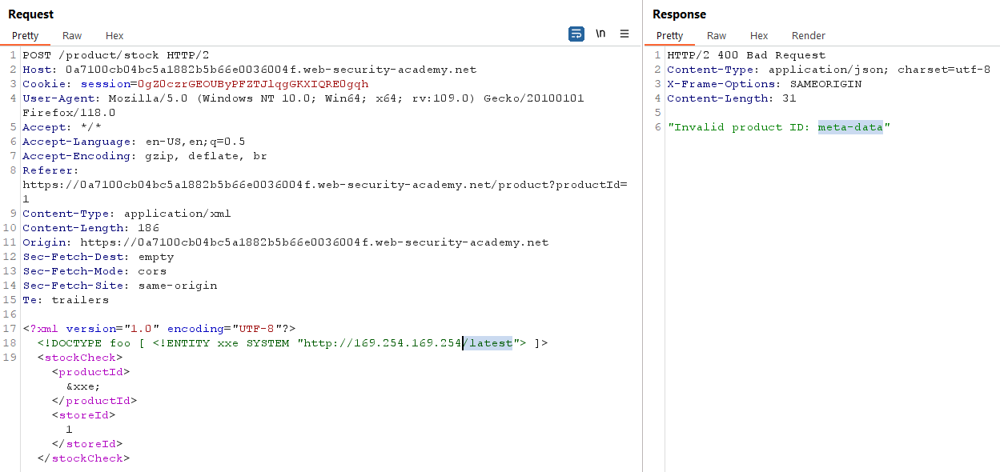

Tìm thấy khóa truy cập `IAM`

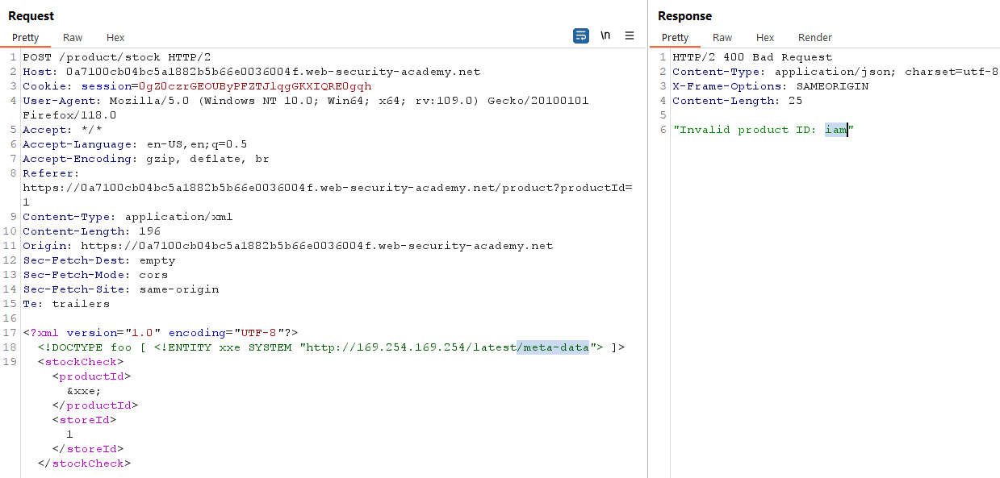

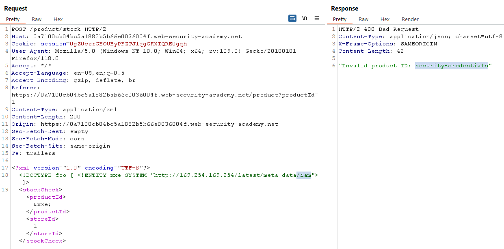

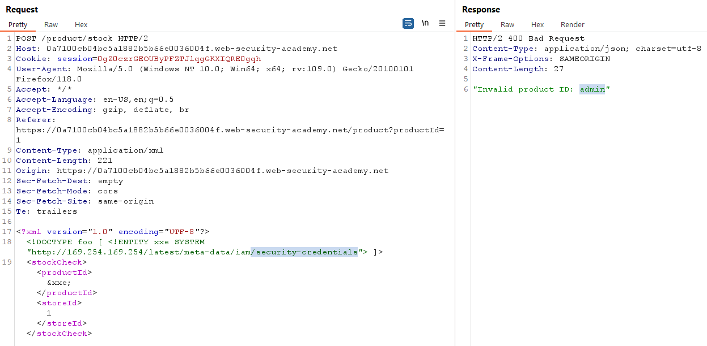

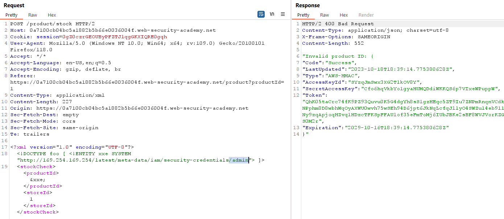

solve the lab

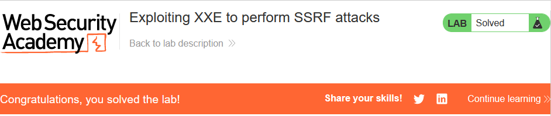

> **Test bằng Active Scan**

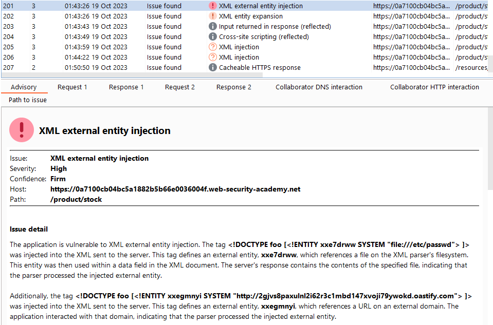

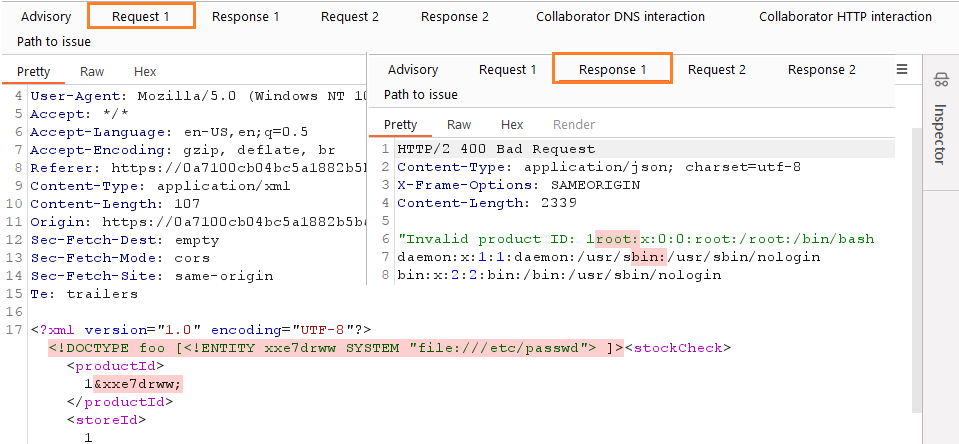
